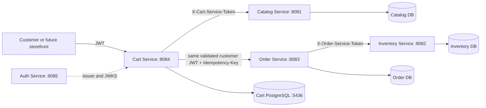
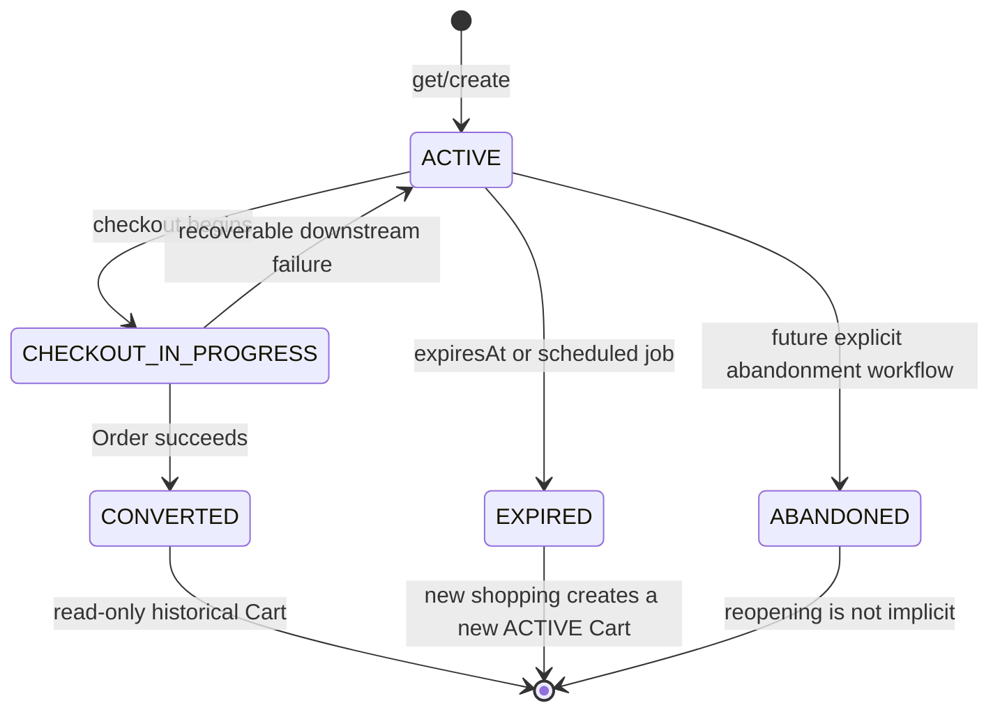
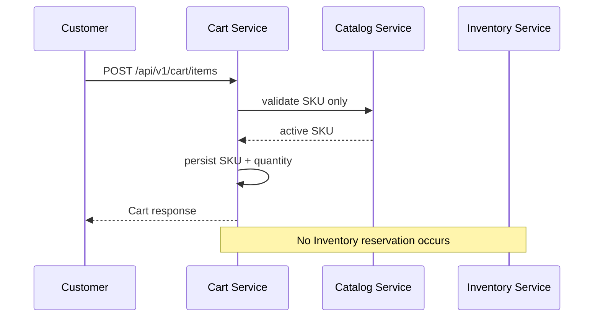
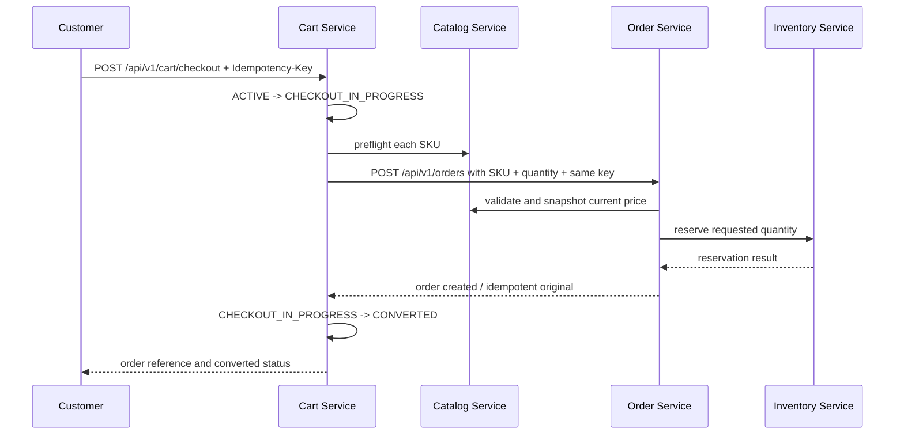
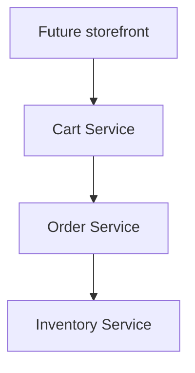

# Cart Service

## Purpose

`cart-service` is a standalone Spring Boot 3.5 / Java 21 service for the authenticated customer's current shopping selection. It runs on port `8084` and owns a dedicated PostgreSQL database exposed on host port `5436`.

The Cart is temporary, mutable intent. It is not an order, invoice, payment record, inventory reservation, or product database.

## Responsibilities

- Create or return one active Cart for the authenticated JWT subject.
- Store normalized SKU and positive quantity pairs.
- Merge repeated additions of the same SKU.
- Enforce cart state, ownership, quantity, and distinct-SKU limits.
- Enrich reads with current Catalog product, variant, price, and currency data when Catalog is available.
- Preserve the persisted cart when Catalog is unavailable.
- Preflight active Catalog SKUs before delegating checkout.
- Pass SKU/quantity and the same `Idempotency-Key` to Order Service.
- Mark the Cart `CONVERTED` only after Order Service returns success.
- Expire active carts without touching Inventory.
- Expose REST, OpenAPI, health, Flyway migrations, Docker, and tests.

## Non-responsibilities

Cart Service does not:

- own Product, Variant, or current price entities;
- import JPA entities from another service;
- access Catalog, Inventory, Order, or Auth databases;
- store physical Inventory Unit IDs or reservation IDs;
- reserve, release, select, or mutate Inventory;
- calculate final order pricing, tax, shipping, payment, or order numbers;
- create an Order database record itself;
- manage Auth users, passwords, refresh tokens, roles, or JWT issuance;
- provide customer checkout or administrative Cart mutations to `ecommerce-admin-ui`.

## Architecture



Every database is independent. There is no shared database and no distributed ACID transaction.

| Service | Source of truth |
|---|---|
| Auth | Customer identity, authentication, permissions, JWT/JWKS |
| Catalog | Product, Variant, SKU, current price, product availability metadata |
| Cart | Current customer SKU selection and Cart lifecycle |
| Inventory | Stock, physical units, availability, reservations |
| Order | Historical order, price/product snapshots, final totals, reservation orchestration |

## Why Cart is Separate from Order

Cart and Order have different lifecycles and consistency requirements:

| Cart | Order |
|---|---|
| Temporary and mutable | Historical and commercially auditable |
| Customer's current selection | Submitted transaction |
| Current Catalog price is only a display estimate | Catalog price is snapshotted immutably |
| Can be abandoned or expire | Must preserve history |
| Does not reserve Inventory | Coordinates Inventory reservation during checkout |

Cart is therefore deliberately not merged into `order-service`.

## Cart vs Order

```text
Cart:  IP17-BLK-256 x 2

Cart does not contain: U001, U002

Cart SKU + quantity
        |
        v
Order validates current Catalog price
        |
        v
Inventory reserves physical units U001, U002
```

The Cart only stores the cross-service SKU string and requested quantity. The Order snapshot and Inventory reservation are created later by their owning services.

## Cart Lifecycle



`CONVERTED`, `ABANDONED`, and `EXPIRED` carts are not mutated by normal item APIs. After conversion or expiry, a later `GET /api/v1/cart` creates a new active cart for the customer.

The implementation uses a PostgreSQL partial unique index so historical carts can remain while only one `ACTIVE` cart exists for a customer.

## Customer Ownership

The customer ID is always `Authentication.getName()`, which is the JWT `sub` claim. No Cart endpoint accepts a customer ID in the body, query string, or path.

All customer operations are authenticated. Cart queries are scoped to the authenticated subject, so a customer cannot read or mutate another customer's Cart or item. An inaccessible item is returned as a non-disclosing `404` from the mutation path.

## SKU Model

Cart item identity is the normalized uppercase SKU, for example `IP17-BLK-256`. A Cart item has only:

- `sku`;
- `quantity`;
- local Cart Item identity and timestamps.

Adding the same SKU twice merges quantities. For example, `2 + 3 = 5` remains one `cart_items` row. The Cart never accepts product IDs, prices, subtotals, totals, or physical Inventory Unit IDs as authoritative input.

## Cart Item Model

| Field | Source, meaning, validation, lifecycle |
|---|---|
| `id` | UUID generated by Cart DB; required, local, immutable. |
| `cartId` | Local FK to `carts.id`; required; cascade-deleted only when a Cart is deleted by data maintenance. |
| `sku` | Catalog/Inventory cross-service identity; required, trimmed and uppercase; immutable for the item. |
| `quantity` | Customer input; positive integer, max configured by `CART_MAX_QUANTITY_PER_SKU`; mutable while Cart is `ACTIVE`. |
| `createdAt` | UTC timestamp assigned by Cart DB; immutable. |
| `updatedAt` | UTC timestamp maintained by Cart DB; changes on quantity updates. |

## Cart Entity and Database Schema

| Field | Source, meaning, validation, lifecycle |
|---|---|
| `id` | UUID generated by Cart DB; technical Cart identifier. |
| `customerId` | JWT subject; required and never accepted from a request payload. |
| `status` | Server-controlled `ACTIVE`, `CHECKOUT_IN_PROGRESS`, `CONVERTED`, `ABANDONED`, or `EXPIRED`. |
| `currency` | Configured supported Cart currency; v1 defaults to `INR` and Catalog SKU currency must match. |
| `createdAt` | UTC creation timestamp; immutable. |
| `updatedAt` | UTC last local mutation timestamp. |
| `expiresAt` | Optional UTC expiration timestamp; active carts are scheduled for expiration. |
| `version` | JPA optimistic-lock version; changed on local Cart writes. Conflicting writes surface as `409`. |
| `checkoutIdempotencyKey` | Local remote-workflow reference used to recognize a successful retry for the same Cart checkout. It is not a second Order idempotency store. |
| `convertedOrderId` / `convertedOrderNumber` | References to the authoritative Order returned by Order Service; not an Order snapshot or local Order entity. |

Tables are `carts` and `cart_items`. `cart_items.cart_id` has a foreign key to `carts.id`, `UNIQUE(cart_id, sku)` prevents duplicate rows, and indexes cover customer, status, expiration, Cart, and SKU lookup.

## Flyway Migrations

`V1__init_cart.sql` creates both tables, UUID primary keys, the active-customer partial unique index, the item uniqueness constraint, state/currency/quantity checks, and operational indexes. Hibernate runs with `ddl-auto=validate`; applied migrations are not edited.

## Pricing / Current Catalog Price

Cart persists no price. `GET /api/v1/cart` and `/summary` call Catalog for each SKU and return current display fields when available:

- product name;
- variant name and attributes;
- current unit price and an estimated line subtotal;
- current currency and active state.

These fields are never written into the Cart database and are not historical data. If Catalog is temporarily unavailable, the Cart still returns persisted SKU/quantity and a warning without inventing product data or price.

## Cart Estimate vs Final Order Total

Cart pricing is a display estimate using current Catalog pricing. It can change between Cart reads. The final order amount is calculated by Order Service from a fresh Catalog lookup and stored in the Order snapshot. Cart never accepts or forwards client-provided prices, subtotals, discounts, taxes, or totals.

## Inventory Availability

Cart does not call Inventory for its v1 read path. The existing Inventory read APIs are operationally permissioned rather than a lightweight customer-facing availability contract, so Cart does not fabricate an `availableQuantity`. Cart responses state that authoritative availability is checked by Order Service at checkout.

This means a Cart may show an item without a numeric stock estimate. That is intentional: an unavailable or stale estimate must never be presented as fact.

## Staff Cart Inspection

The read-only staff surface is exposed separately from the customer-owned `/api/v1/cart` resource:

- `GET /api/v1/carts` lists Cart summaries with server-side search, status, SKU, pagination, and supported sorting;
- `GET /api/v1/carts/{cartId}` returns one Cart with its persisted customer reference, SKU/quantity lines, current Catalog enrichment, and converted Order reference when present.

Both endpoints require the Auth permission `CART_READ`. They do not accept a customer ID as a mutation input, perform checkout, change Cart items, or reserve Inventory. The current response returns only `customerId`; customer name/email and Cart lifecycle history are not exposed by this service and must not be fabricated by the admin UI. The admin UI reads numeric current Inventory availability separately from Inventory's `GET /api/v1/inventory/{sku}` when the operator also has `INVENTORY_READ`.

## IMPORTANT: Why Cart Does Not Reserve Inventory

Adding an item to Cart performs no Inventory write and creates no reservation:



Reserving on add-to-cart would lock stock for abandoned carts and create unnecessary contention. Inventory reservation happens only in Order Service's checkout workflow.

## Checkout Flow



Cart does not open a distributed transaction around these calls. If Catalog or Order fails before success, Cart returns to `ACTIVE`. If Order succeeds, Cart records the remote Order reference and is read-only.

## Catalog Integration

Cart calls the existing `GET /internal/catalog/skus/{sku}` endpoint over HTTP. It does not import Catalog entities or read the Catalog database. A dedicated `X-Cart-Service-Token` is accepted by the repository's Catalog internal filter with `SERVICE_CART` authority.

When adding a new SKU, unknown returns `404`, inactive returns `409`, and unavailable/malformed Catalog responses return `503`. A previously persisted item is retained when it becomes inactive or is removed; reads mark it unavailable and checkout preflight prevents conversion.

## Order Integration

Cart calls the existing `POST /api/v1/orders` contract with:

```json
{
  "currency": "INR",
  "items": [
    {"sku": "IP17-BLK-256", "quantity": 2}
  ],
  "preferredLocationId": null
}
```

The request does not contain customer ID, unit price, subtotal, total, product data, or physical unit IDs. Cart sends the same `Idempotency-Key` to Order. The current Order API requires the authenticated customer JWT and derives `customerId` from its `sub`, so Cart forwards the already-present bearer token only on this delegated checkout request; it never stores or logs the token.

Order remains authoritative for Catalog price snapshots, totals, order number, Inventory reservation, and Order status.

## Inventory Integration

Cart never directly reserves, releases, or selects Inventory Units. Order Service calls the existing Inventory reservation API. An insufficient-quantity response is surfaced as a `409`, and Cart remains active so the customer can change quantity. Inventory unavailability is surfaced as `503` and Cart remains active.

## Authentication

Cart is a Spring Security OAuth2 Resource Server. With security enabled, it validates:

- JWT signature through `AUTH_JWK_SET_URI`;
- `AUTH_ISSUER`;
- `AUTH_AUDIENCE`;
- expiration and standard JWT time claims.

Cart never queries `auth_db` per request. Set `APP_SECURITY_ENABLED=false` only for isolated local development or tests.

## Authorization

Customer Cart operations require authentication and are authorized by subject ownership. No role-name check such as `role == ADMIN` is used. Staff inspection uses the separate read-only `/api/v1/carts` route and explicit `CART_READ` permission; it does not grant staff mutation or checkout capabilities.

## Idempotency

`POST /api/v1/cart/checkout` requires `Idempotency-Key` with a maximum length of 200 characters. Cart passes this key unchanged to Order, which owns the authoritative `(customerId, key, request fingerprint)` semantics. Cart retains the key and returned Order reference on a converted Cart only to make a successful repeated request return the same conversion result without creating a second Order.

If a downstream failure occurs, Cart returns to `ACTIVE`; retrying the same key is safe because Order owns idempotency. A different key cannot mutate a converted Cart because a new active Cart is created for future shopping.

## Concurrency

Cart writes lock the active Cart row during local mutation and use JPA `@Version` optimistic locking. The database unique constraint prevents duplicate active carts and `UNIQUE(cart_id, sku)` prevents duplicate SKU rows. A stale concurrent write returns a structured `409 CONCURRENT_UPDATE` response.

Remote HTTP calls occur outside local database transactions. Checkout uses explicit state transitions rather than a distributed transaction.

## Expiration

New active carts receive `expiresAt = now + CART_EXPIRATION_DURATION` (default `30d`). A scheduled job marks due `ACTIVE` carts as `EXPIRED`. Expiration has no Inventory side effect. A later `GET /api/v1/cart` creates a new active Cart rather than silently reopening the expired record.

## Abandonment

No automatic abandonment heuristic is implemented. If a future explicit abandonment workflow is added, it will transition a Cart to `ABANDONED` without reserving or releasing Inventory. Expiration and abandonment are Cart lifecycle concepts, not reservation concepts.

## Converted Carts

Converted Carts and their CartItems remain in the Cart database for support/debugging. They store only a remote Order reference, not an Order copy. Normal item mutation cannot change them. A new shopping session creates a new active Cart.

## API Reference

All endpoints require `Authorization: Bearer <customer-jwt>` except health and OpenAPI endpoints.

| Method | Endpoint | Behavior |
|---|---|---|
| `GET` | `/api/v1/cart` | Return or create the authenticated customer's active Cart. |
| `GET` | `/api/v1/cart/summary` | Same current enriched Cart representation for storefront summary use. |
| `POST` | `/api/v1/cart/items` | Validate active SKU in Catalog; add or merge quantity. No reservation. |
| `PATCH` | `/api/v1/cart/items/{itemId}` | Replace quantity; quantity must be positive. |
| `DELETE` | `/api/v1/cart/items/{itemId}` | Remove one owned item. |
| `DELETE` | `/api/v1/cart` | Clear items while retaining the active Cart record. |
| `POST` | `/api/v1/cart/checkout` | Validate, delegate to Order, and convert only after Order success. Requires `Idempotency-Key`. |

Swagger UI: `http://localhost:8084/swagger-ui.html`  
OpenAPI JSON: `http://localhost:8084/v3/api-docs`  
Health: `http://localhost:8084/actuator/health`

## Request/Response Examples

### Get an empty Cart

```http
GET /api/v1/cart
Authorization: Bearer <jwt>
```

```json
{
  "id": "7a8b9c10-1112-4131-8192-a1b2c3d4e5f6",
  "status": "ACTIVE",
  "currency": "INR",
  "itemCount": 0,
  "totalQuantity": 0,
  "enrichmentAvailable": true,
  "warnings": [],
  "items": []
}
```

### Add and merge an item

```http
POST /api/v1/cart/items
Authorization: Bearer <jwt>
Content-Type: application/json

{"sku":"IP17-BLK-256","quantity":2}
```

```json
{
  "status": "ACTIVE",
  "currency": "INR",
  "itemCount": 1,
  "totalQuantity": 2,
  "items": [
    {
      "sku": "IP17-BLK-256",
      "quantity": 2,
      "product": {"name":"iPhone 17 Pro","variant":"Black / 256GB","attributes":{"color":"Black","storage":"256GB"}},
      "pricing": {"unitPrice":129900.00,"currency":"INR","subtotalEstimate":259800.00},
      "availability": {"known":false,"availableQuantity":null,"message":"Availability is checked authoritatively by Order Service at checkout"},
      "unavailable": false
    }
  ]
}
```

Adding the same SKU with quantity `3` returns quantity `5` in the same item row.

### Update, remove, and clear

```http
PATCH /api/v1/cart/items/{itemId}
Authorization: Bearer <jwt>
Content-Type: application/json

{"quantity":5}
```

```http
DELETE /api/v1/cart/items/{itemId}
Authorization: Bearer <jwt>
```

```http
DELETE /api/v1/cart
Authorization: Bearer <jwt>
```

`PATCH` rejects zero; use `DELETE` to remove an item. Clearing leaves an empty `ACTIVE` Cart record.

### Checkout

```http
POST /api/v1/cart/checkout
Authorization: Bearer <jwt>
Idempotency-Key: cart-checkout-123
Content-Type: application/json

{"currency":"INR","preferredLocationId":null}
```

```json
{
  "cartId": "7a8b9c10-1112-4131-8192-a1b2c3d4e5f6",
  "cartStatus": "CONVERTED",
  "orderId": "2b0d8c88-1938-4d13-b44f-7f0bcce7d9fb",
  "orderNumber": "ORD-20260921-000001",
  "orderStatus": "PENDING_PAYMENT",
  "message": "Order created and cart converted"
}
```

## Error Handling

Errors use the common structure:

```json
{
  "timestamp":"2026-09-21T10:00:00Z",
  "status":409,
  "error":"Conflict",
  "code":"CHECKOUT_CONFLICT",
  "message":"Order could not be created because inventory or checkout state conflicted",
  "details":[]
}
```

| Status | Examples |
|---|---|
| `400` | Blank/malformed SKU, non-positive quantity, unsupported currency, missing/oversized idempotency key. |
| `401` | Missing or invalid JWT. |
| `403` | Authenticated principal is denied by a future explicit permission boundary. |
| `404` | Unknown Catalog SKU on add, or item not owned by the current customer. |
| `409` | Inactive SKU, empty checkout, cart limit, invalid lifecycle state, insufficient Inventory, idempotency conflict, concurrent update. |
| `503` | Catalog, Order, or a downstream dependency is unavailable. Persisted Cart data is retained. |
| `500` | Unexpected server error without stack trace disclosure. |

## Service-to-Service Authentication

Cart-to-Catalog uses `CART_CATALOG_SERVICE_TOKEN`, sent as `X-Cart-Service-Token`. This credential is server-side only and is never exposed to a browser. Cart does not send customer JWTs to Catalog.

The current Order API authenticates customer order creation with the customer JWT. Cart forwards the already-authenticated bearer token only for the delegated Order request so Order can independently validate signature, issuer, audience, expiry, and customer subject. Cart does not log, persist, or expose that token. If the platform later adds a dedicated Order service credential plus customer-context contract, the client can be switched without changing Cart persistence.

## Docker

Build the application before building the image:

```bash
cd cart-service
mvn clean package
docker compose up --build
```

The Compose file starts:

- `cart-postgres` logically as `cart-db`, PostgreSQL container port `5432`, host port `5436`;
- `cart-service`, host/container port `8084`.

Inside Compose, the Cart JDBC URL uses `cart-db:5432`. The default service URLs use `host.docker.internal` because the existing Catalog, Order, Inventory, and Auth services may be running on the host. If those services are also Compose services, replace the URLs with their Compose service names.

## Local Development

For host-based development, start PostgreSQL on port `5436`, then run:

```bash
cd cart-service
set -a; source .env; set +a
mvn spring-boot:run
```

The default local URLs are:

```text
Cart       http://localhost:8084
Catalog    http://localhost:8081
Inventory  http://localhost:8082
Order      http://localhost:8083
Auth       http://localhost:8085
Admin UI   http://localhost:3000
```

The standard service startup order is Auth, Catalog, Inventory, Order, then Cart. Cart can start before remote services are healthy; its database and health endpoint remain local, while dependent calls return structured `503` responses until the remote service is available.

## Environment Variables

| Variable | Default | Meaning |
|---|---|---|
| `CART_SERVER_PORT` | `8084` | HTTP port. |
| `CART_DB_URL` | `jdbc:postgresql://localhost:5436/cart_db` | Cart-only PostgreSQL JDBC URL. |
| `CART_DB_USERNAME` / `CART_DB_PASSWORD` | `cart` / `cart` | Cart DB credentials. |
| `CART_CURRENCY` | `INR` | Supported Cart currency; must match Catalog SKU currency. |
| `CART_EXPIRATION_DURATION` | `30d` | Lifetime for an active cart. |
| `CART_MAX_ITEMS` | `100` | Maximum distinct SKUs. |
| `CART_MAX_QUANTITY_PER_SKU` | `100` | Maximum quantity for one SKU after merge. |
| `CATALOG_SERVICE_URL` | `http://localhost:8081` | Catalog HTTP base URL. |
| `ORDER_SERVICE_URL` | `http://localhost:8083` | Order HTTP base URL. |
| `INVENTORY_SERVICE_URL` | `http://localhost:8082` | Reserved for future display integration; not called by v1. |
| `CART_CATALOG_SERVICE_TOKEN` | `dev-cart-to-catalog` | Server-only Cart-to-Catalog token; must match Catalog's `CART_SERVICE_TOKEN`. |
| `AUTH_ISSUER` | `http://localhost:8085` | JWT issuer. |
| `AUTH_AUDIENCE` | `ecommerce-api` | Required JWT audience. |
| `AUTH_JWK_SET_URI` | `http://localhost:8085/.well-known/jwks.json` | JWKS endpoint. |
| `APP_SECURITY_ENABLED` | `true` | Only disable for isolated local development/tests. |

See `.env.example`. No real secret is committed.

## Maven

```bash
mvn clean test
mvn spring-boot:run
```

The project uses Spring Boot 3.5.6, Java 21, Spring Data JPA, PostgreSQL, Flyway, Spring Security Resource Server, SpringDoc, JUnit 5, and Testcontainers PostgreSQL.

## Colima

The Testcontainers test includes the same portable Docker-socket detection used by the other repository services. With Colima, start the VM before running the integration test:

```bash
colima start
mvn test
```

If no Docker environment is available, unit/client tests still run and the PostgreSQL integration test is skipped using `@Testcontainers(disabledWithoutDocker = true)`.

## Testcontainers

`CartPersistenceIntegrationTest` runs Flyway and JPA against PostgreSQL 17 in Testcontainers. It verifies Cart/CartItem persistence and the database-mapped model. The service unit tests verify duplicate-SKU merging, limits, state recovery, and converted-cart immutability. `CatalogClientTest` verifies the actual Catalog endpoint path, service-token header, unknown SKU, and inactive SKU behavior.

## Testing

Recommended verification:

```bash
mvn clean test
```

Then, with PostgreSQL and the services running:

1. Authenticate a customer with Auth Service.
2. `GET /api/v1/cart` and verify an empty `ACTIVE` Cart.
3. Add a SKU twice and verify one CartItem with merged quantity.
4. Inspect Inventory reservations and verify add-to-cart created none.
5. Change Catalog price and refresh Cart; verify the display estimate uses the current price.
6. Checkout with a stable `Idempotency-Key`.
7. Verify Order owns the price snapshot and Inventory reservation.
8. Verify Cart is `CONVERTED`.
9. Repeat the same checkout key and verify no duplicate Order or reservation.
10. Add a different SKU after conversion and verify a new active Cart is created.

## Failure Scenarios

| Scenario | Cart behavior |
|---|---|
| Catalog unavailable while adding | Reject with `503`; do not persist unknown SKU. |
| Catalog unavailable while reading | Return persisted SKU/quantity with partial-enrichment warning. |
| SKU becomes inactive | Retain item, mark unavailable, prevent checkout. |
| Order unavailable | Return `503`, restore `ACTIVE`, preserve items. |
| Inventory insufficient through Order | Return `409`, restore `ACTIVE`, allow quantity changes. |
| Order succeeds but client retries | Same key returns recorded converted Order reference. |
| Concurrent Cart write | JPA/database locking returns `409` instead of silently losing an update. |
| Expiration | Mark `EXPIRED`; no Inventory side effect; future shopping creates a new active Cart. |

## Troubleshooting

- `503 Catalog`: check `CATALOG_SERVICE_URL`, `CART_CATALOG_SERVICE_TOKEN`, and Catalog's `CART_SERVICE_TOKEN`.
- `503 Order`: check `ORDER_SERVICE_URL`, the customer JWT, issuer/audience/JWKS settings, and Order health.
- `401`: verify the JWT signature, issuer, audience, expiry, and `AUTH_JWK_SET_URI`.
- Flyway validation failure: do not edit `V1__init_cart.sql` after it has been applied; inspect the database schema and create a new migration.
- Docker connection from a container: use `cart-db:5432` for PostgreSQL and `host.docker.internal` for host services, not `localhost`.
- Integration test skipped: start Docker/Colima and rerun `mvn test`.

## Future Storefront Integration

The future `ecommerce-storefront` should call Cart Service with the customer's JWT. It should not call Catalog or Inventory databases directly, send prices, send customer IDs, or expect Cart to reserve stock.



## Future Improvements

- Add a customer-facing Inventory availability endpoint with an explicit service contract if numeric estimates become important.
- Add an explicit authenticated abandonment endpoint if product requirements need one.
- Add an outbox or reconciliation workflow if conversion recovery needs stronger operational guarantees.
- Add a dedicated service-to-service Order contract if the platform removes customer-JWT forwarding.

Kafka, Redis, Kubernetes, payment, shipping, and public storefront code are intentionally out of scope for this v1 service.
