# Customer Service

## Purpose

`customer-service` owns the current customer profile and address book. It is a
standalone Spring Boot 3.5.6 application on port `8086` with its own PostgreSQL
database on host port `5437`.

## Responsibilities

- Customer profile fields: name, display/contact email copy, phone, and customer status.
- Customer shipping and billing addresses.
- One current default shipping address and one current default billing address when addresses of those types exist.
- Ownership checks for every `/me` operation.
- Least-privilege admin list/detail/status/profile APIs for the Admin UI.

## Non-responsibilities

Auth Service owns registration, passwords, credentials, JWTs, refresh tokens,
roles, permissions, and Auth account status. Customer Service never stores any
of those values and never reads the Auth database. Catalog owns products and
prices; Inventory owns stock and reservations; Cart owns mutable shopping
selection; Order owns orders, order lifecycle, historical prices, and historical
customer/address snapshots.

## Architecture

```text
Auth JWT (sub = Auth user UUID)
          |
          v
Customer Service  ---- private customer_db
  profile                  |
  addresses                +-- customers
                           +-- customer_addresses
```

There is no shared database and no imported JPA entity. Customer Service uses
the Auth-issued JWT as a resource server and validates signature, issuer,
audience, and expiration locally through the Auth JWKS endpoint.

## Auth User vs Customer

An Auth User answers: “Who can authenticate?” A Customer answers: “What
profile belongs to that identity?” The Auth UUID in JWT `sub` is stored as
`customers.auth_user_id`. `customers.id` is Customer Service's internal
profile identifier. The two are intentionally different identifiers, with a
unique one-to-one mapping from Auth identity to profile.

Auth and Customer status are independent. For example, an Auth user may be
`ACTIVE` while the Customer profile is `INACTIVE`; authentication can still
succeed at Auth, but Customer Service returns `403 FORBIDDEN` for customer
operations until the profile is active. `BLOCKED` has the same API behavior as
`INACTIVE` but communicates a business restriction rather than a normal
deactivation.

## Identity Ownership

Every customer-facing request derives identity only from the authenticated JWT
subject. Request bodies do not accept `customerId` or `authUserId`. A malformed
or non-UUID subject is rejected as unauthenticated. Address lookups use
`findByIdAndCustomerId`; an address owned by another customer is reported as
`404` to avoid existence disclosure.

## Customer Model

| Field | Type | Required | Source, lifecycle, and security |
| --- | --- | --- | --- |
| `id` | UUID | Yes | Immutable Customer Service identifier, generated locally. Never client-settable. |
| `authUserId` | UUID | Yes | Immutable Auth identity from JWT `sub`; unique and never client-settable. |
| `firstName` | String, max 80 | No on lazy creation | Customer display profile. Mutable only through the profile PATCH endpoint; trim whitespace. |
| `lastName` | String, max 80 | No on lazy creation | Customer display profile. Mutable only through the profile PATCH endpoint; trim whitespace. |
| `email` | String, max 320 | No | Auth is the source of truth. Customer Service mirrors the signed Auth claim on authenticated profile reads; it does not accept email changes. |
| `phone` | Normalized String, max 16 | No | Customer contact data. Stored as `+` plus 7–15 digits; mutable through profile PATCH. |
| `status` | `ACTIVE`, `INACTIVE`, `BLOCKED` | Yes | Customer business lifecycle, default `ACTIVE`; not Auth account status and not client-settable. |
| `createdAt` | Instant | Yes | Database/application creation timestamp; immutable and read-only. |
| `updatedAt` | Instant | Yes | Updated on profile changes; read-only. |

The first authenticated `/api/v1/customers/me` call lazily creates a profile
with the JWT subject and `ACTIVE` status. Auth registration remains independent
and available even if Customer Service is temporarily unavailable. Auth access
tokens carry signed email and name claims; Customer Service mirrors email and
backfills missing profile names from those claims when the profile is read.
Customer-edited names and phone remain locally editable. There is no anonymous
or browser-accessible internal creation endpoint.

## Customer Status

- `ACTIVE`: normal Customer Service operations are allowed.
- `INACTIVE`: profile is intentionally disabled; customer operations return `403`.
- `BLOCKED`: business-level restriction; customer operations return `403`.

Auth account status remains authoritative for authentication. A valid Auth JWT
does not override an inactive or blocked customer profile.

## Address Model

| Field | Type | Required | Source, lifecycle, and security |
| --- | --- | --- | --- |
| `id` | UUID | Yes | Locally generated immutable address identifier. |
| `customerId` | UUID | Yes | Internal foreign key to `customers`; derived from JWT, never accepted from clients. |
| `addressType` | `SHIPPING` or `BILLING` | Yes | Determines the independent default slot. Mutable by full replacement. |
| `recipientName` | String, max 120 | Yes | Delivery recipient supplied by the authenticated customer; trimmed. |
| `phone` | normalized String, max 16 | Yes | Address contact number; international baseline validation and normalized storage. |
| `line1` | String, max 200 | Yes | Primary street/address line; trimmed. |
| `line2` | String, max 200 | No | Apartment, suite, or additional line; blank values become null. |
| `city` | String, max 120 | Yes | Locality; trimmed, with no country-specific assumptions. |
| `state` | String, max 120 | Yes | State/province/region; required as a general baseline. |
| `postalCode` | String, max 20 | Yes | General international format, not India-only PIN validation. `302001` is valid. |
| `country` | ISO 3166-1 alpha-2 String | Yes | Validated against Java's ISO country set and stored uppercase, e.g. `IN`, `US`, `GB`. |
| `landmark` | String, max 200 | No | Optional delivery hint; blank values become null. |
| `isDefault` | Boolean | Yes in response | Current default flag, maintained transactionally and by a PostgreSQL partial unique index. |
| `createdAt` | Instant | Yes | Creation timestamp; read-only. |
| `updatedAt` | Instant | Yes | Last address modification timestamp; read-only. |

## Address Types

Only `SHIPPING` and `BILLING` are supported. Defaults are independent, so a
customer can have one shipping default and a different billing default. An
address is not implicitly both types; clients may create two records when the
same physical location should serve both purposes.

## Default Address Rules

- The first address of each type becomes default, even when `isDefault` is false.
- `isDefault=true` replaces the existing default of that type in one transaction.
- `POST /{id}/default` replaces only the address's own type default.
- A default remains default when updated unless another address is explicitly selected.
- When a default is deleted, the newest remaining address of that type is promoted. If none remains, that type has no default until the next address is created.
- A PostgreSQL partial unique index prevents two defaults of the same type for one customer even if application code regresses or concurrent requests race.
- All default mutations lock the owning customer row with `PESSIMISTIC_WRITE`, then update the same-type addresses in one transaction.

## Address Validation

Phone numbers accept a reasonable international baseline and are normalized to
`+` plus 7–15 digits. Spaces, parentheses, periods, and hyphens are removed;
`00` is converted to `+`. Postal codes are deliberately country-neutral. The
service requires a two-letter ISO country code, but does not assume an Indian
PIN or any one country's address grammar.

## Authentication

Send `Authorization: Bearer <Auth access token>`. The service validates the
RS256 JWT using:

```text
issuer:   AUTH_ISSUER (default http://localhost:8085)
audience: AUTH_AUDIENCE (default ecommerce-api)
JWKS:     AUTH_JWK_SET_URI (default http://localhost:8085/.well-known/jwks.json)
```

No Auth database query is made per request. The service stores no JWT, password,
password hash, or refresh token. Swagger marks customer endpoints with
`bearerAuth`. Health and OpenAPI endpoints are public.

## Authorization

Normal profile and address operations require authentication and an active
Customer profile. Admin APIs require the Auth JWT permissions `CUSTOMER_READ`
or `CUSTOMER_UPDATE`; they do not use the owner-derived `/me` identity and do
not access the Auth database.

## Customer APIs

### `GET /api/v1/customers/me`

Auth: Bearer JWT. No path/query parameters or body. Creates an empty active
profile on first access, synchronizes the Auth email and backfills missing
names from signed claims, then returns `CustomerResponse`. Returns `401` for
missing/invalid identity and `403` for `INACTIVE`/`BLOCKED`.

### `PATCH /api/v1/customers/me`

Auth: Bearer JWT. JSON body may contain only `firstName`, `lastName`, and
`phone`; omitted fields remain unchanged. `id`, `authUserId`, `status`, and
`email` are not accepted. Unknown fields fail with `400`, preventing accidental
auth/security-field changes. Email changes belong to a future authenticated
verification workflow in Auth.

## Address APIs

All address endpoints use the authenticated customer from JWT and return `404`
for another customer's address.

| Method | Path | Body/params | Success | Side effects |
| --- | --- | --- | --- | --- |
| `GET` | `/api/v1/customers/me/addresses` | None | `200`, default first then newest | None |
| `POST` | `/api/v1/customers/me/addresses` | `AddressRequest`; no customer ID | `201` | Creates address and applies default rules |
| `GET` | `/api/v1/customers/me/addresses/{id}` | UUID path ID | `200` | None |
| `PUT` | `/api/v1/customers/me/addresses/{id}` | Complete `AddressRequest` | `200` | Replaces fields and preserves/selects default as documented |
| `DELETE` | `/api/v1/customers/me/addresses/{id}` | UUID path ID | `204` | Deletes and promotes a replacement default when needed |
| `POST` | `/api/v1/customers/me/addresses/{id}/default` | None | `200` | Makes this address the sole default for its type |

Example `AddressRequest`:

```json
{
  "addressType": "SHIPPING",
  "recipientName": "Mihir Chittora",
  "phone": "+919876543210",
  "line1": "123 Example Street",
  "line2": "Apartment 4B",
  "city": "Udaipur",
  "state": "Rajasthan",
  "postalCode": "313001",
  "country": "IN",
  "landmark": "Near the market",
  "isDefault": true
}
```

## Admin APIs

| Method | Path | Permission | Purpose |
| --- | --- | --- | --- |
| `GET` | `/api/v1/customers?page=0&size=20&search=&status=` | `CUSTOMER_READ` | Server-paginated profile list with name/email/Auth-ID search and status filtering |
| `GET` | `/api/v1/customers/{id}` | `CUSTOMER_READ` | Read one customer profile |
| `GET` | `/api/v1/customers/by-auth-user/{authUserId}` | `CUSTOMER_READ` | Resolve a profile from an Order/Cart/Payment/Shipping Auth user reference |
| `GET` | `/api/v1/customers/{id}/addresses` | `CUSTOMER_READ` | Read current shipping and billing addresses |
| `PATCH` | `/api/v1/customers/{id}` | `CUSTOMER_UPDATE` | Update first name, last name, and phone |
| `PATCH` | `/api/v1/customers/{id}/status` | `CUSTOMER_UPDATE` | Set `ACTIVE`, `INACTIVE`, or `BLOCKED` |

Email, Auth identity, passwords, roles, and permissions remain Auth-owned. The
Admin UI intentionally displays addresses read-only; address mutations remain
customer-owned until a separate address administration workflow is required.

## Customer Ownership

Ownership is enforced in the application query (`address id + customer id`),
the foreign key, and the route design. The service does not trust client
`customerId` or `authUserId` fields. It does not expose an address existence
signal across customers.

## Auth → Customer Profile Creation

The current flow is lazy and deterministic:

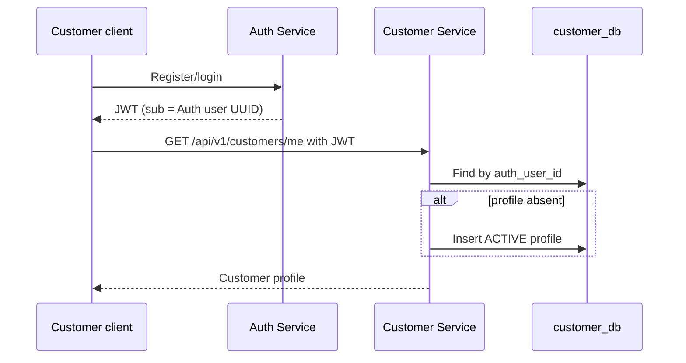

Registration does not duplicate profile creation or call a private endpoint.
The unique `auth_user_id` constraint makes retries idempotent. The signed JWT
identity claims provide the trusted Auth → Customer display-copy sync without
giving Customer Service access to the Auth database.

## Service-to-Service Authentication

There is no service-to-service call in the current lazy flow. `SERVICE_AUTH_TOKEN`
is documented as a reserved environment variable for a future protected
internal profile-creation flow; it is not used by the browser and no anonymous
`/internal/customers` endpoint is exposed.

## Email Ownership

Auth remains the source of truth for identity email. Customer `email` is an
optional display/cache field and is not writable through Customer Service; it
is refreshed from the signed Auth claim on `/me` reads. Auth owns any future
verified email-change flow.

## Cart Integration

Cart already identifies its owner from the Auth JWT subject and stores that
reference in its own database. Customer Service does not create a second Cart
identity and does not share Cart tables. Cart may call this service later for
display enrichment, but current Cart ownership remains its existing contract.

## Order Integration

Order already stores its own customer reference and historical transaction
data. For future checkout address enrichment, Order should obtain the current
address from Customer Service and copy it into the order transaction. It must
not retain a mutable foreign-key dependency on `customer_addresses`.

## Shipping Address Snapshot

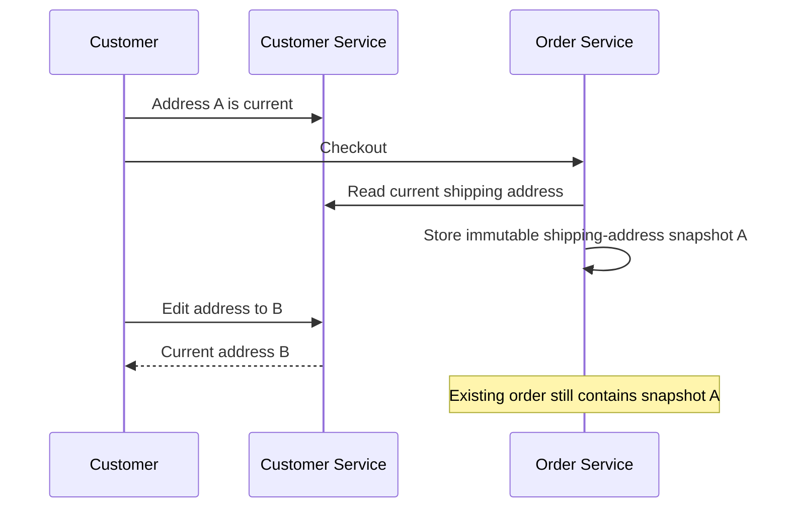

The snapshot is owned by Order and must not change when a customer edits or
deletes their current address.

## Database Schema

Database `customer_db` contains only `customers` and `customer_addresses`.
`customer_addresses.customer_id` is a foreign key with cascade delete inside
this service database. `auth_user_id` is unique. Indexes cover customer email,
phone, address owner, type, and default flag. The partial unique index
`uk_customer_addresses_one_default_per_type` enforces one default per customer
and type.

## Flyway Migrations

`V1__init_customer.sql` creates both tables, foreign keys, checks, indexes, and
the partial unique default constraint. Future migrations must be additive and
must not edit this already-applied migration.

## Request/Response Examples

`GET /api/v1/customers/me` returns:

```json
{
  "id": "2ea0c7a0-1d0e-4e61-8d84-4f2ec675b8f9",
  "authUserId": "b6f0206d-39a2-4ca1-8452-5d8a23ed8a52",
  "firstName": "Mihir",
  "lastName": "Chittora",
  "email": null,
  "phone": "+919876543210",
  "status": "ACTIVE",
  "createdAt": "2026-09-21T09:00:00Z",
  "updatedAt": "2026-09-21T09:05:00Z"
}
```

`GET /api/v1/customers/me/addresses` returns an array of `AddressResponse`
objects ordered with defaults first, then newest creation time.

## Error Handling

All application errors use a structured body:

```json
{
  "timestamp": "2026-09-21T09:10:00Z",
  "status": 404,
  "code": "NOT_FOUND",
  "message": "Address not found",
  "path": "/api/v1/customers/me/addresses/…",
  "fieldErrors": {}
}
```

`400` is validation/invalid JSON, `401` is unauthenticated, `403` is inactive
or unauthorized, `404` is not found or not owned, `409` is a data/business
conflict, `503` is reserved for unavailable future dependencies, and `500`
does not expose a stack trace.

## Docker

Build the JAR first because this service's Dockerfile copies `target/`:

```bash
cd /Users/mihirchittora/Desktop/my-ecommerce/customer-service
mvn -DskipTests package
docker-compose up -d --build
```

The host exposes Customer Service at `http://localhost:8086` and PostgreSQL at
`localhost:5437`. Inside Compose, the application uses
`jdbc:postgresql://customer-db:5432/customer_db`; `localhost` inside a
container is not the database container. Auth JWKS uses
`host.docker.internal` in the Compose default so the service can reach the
host-published Auth service while the JWT issuer remains `localhost:8085`.

## Local Development

```bash
cp .env.example .env
mvn spring-boot:run
```

Start PostgreSQL with `docker-compose up -d customer-db`, or point
`CUSTOMER_DB_URL` at a local PostgreSQL instance. Swagger UI is at
<http://localhost:8086/swagger-ui.html> and OpenAPI JSON is at
<http://localhost:8086/v3/api-docs>.

## Environment Variables

| Variable | Default | Purpose |
| --- | --- | --- |
| `CUSTOMER_SERVER_PORT` | `8086` | HTTP port |
| `CUSTOMER_DB_URL` | `jdbc:postgresql://localhost:5437/customer_db` | Dedicated Customer DB |
| `CUSTOMER_DB_USERNAME` | `customer` | DB user |
| `CUSTOMER_DB_PASSWORD` | `customer` | Local DB password; use a secret outside local development |
| `AUTH_ISSUER` | `http://localhost:8085` | Required JWT issuer |
| `AUTH_AUDIENCE` | `ecommerce-api` | Required JWT audience |
| `AUTH_JWK_SET_URI` | `http://localhost:8085/.well-known/jwks.json` | Auth public keys |
| `SERVICE_AUTH_TOKEN` | empty | Reserved for a future protected internal flow |

## Maven

The project uses Java 21, Spring Boot 3.5.6, SpringDoc 2.9.1, Flyway, and the
same Testcontainers BOM version (`2.0.5`) used by the existing services.

```bash
mvn compile
mvn test
```

## Colima

Testcontainers detects `~/.colima/default/docker.sock` in the test helper when
`DOCKER_HOST` is not already set. Start Colima before `mvn test`:

```bash
colima start
docker info
```

## Testcontainers

Integration tests use PostgreSQL 17 and Flyway against the real migration. They
exercise profile creation/uniqueness, validation boundaries, inactive profile
behavior, address ownership, shipping/billing default separation, concurrent
default replacement, and unauthenticated HTTP access. Docker is intentionally
not disabled or replaced with an in-memory database.

## Testing

The concurrency test starts simultaneous default changes for two shipping
addresses. Customer-row pessimistic locking serializes the application work,
and the PostgreSQL partial unique index is the final invariant guard. Ownership
tests cover cross-customer reads and default changes; the service query returns
`404` rather than leaking another customer's address.

## Concurrency

Default updates lock the owning `customers` row before reading or changing
same-type addresses. The unique partial index makes it impossible to commit
two default rows for the same `(customer_id, address_type)`.

## Security

JWT validation is local and stateless. No passwords, password hashes, JWTs,
refresh tokens, full Authorization headers, or security internals are stored or
logged. Unknown profile fields fail validation, so auth/security properties
cannot be mass-assigned through `/me`.

## Data Privacy

Addresses and phone numbers are sensitive PII. Self-service responses contain
only the authenticated customer's own data; admin responses require the
explicit `CUSTOMER_READ` or `CUSTOMER_UPDATE` permission and return only
customer profile/address fields. No order data, roles, or permissions are
returned. Production deployments should use
secret management, TLS, database encryption/access controls, and retention
policies appropriate to the deployment.

## Troubleshooting

- `401`: check token signature, `AUTH_ISSUER`, `AUTH_AUDIENCE`, and reachable `AUTH_JWK_SET_URI`.
- `403`: the Auth token is valid, but the Customer profile is `INACTIVE` or `BLOCKED`.
- `409` on a default race: retry the request; the database invariant is intact.
- Compose cannot reach Auth: keep the issuer as `http://localhost:8085` but use the container-reachable `host.docker.internal` JWK URL.
- Flyway validation failure: do not edit `V1__init_customer.sql`; inspect the database and add a new migration.
- Testcontainers cannot start: start Docker Desktop/Colima and verify `docker info`; tests are not silently skipped.

## Future Improvements

- A verified Auth-owned email-change flow; refreshed JWT claims propagate the
  new email to Customer Service on the next `/me` read.
- Least-privilege, paginated admin search after Auth permissions are extended deliberately.
- Customer preferences/consent as separate, purpose-specific models.
- Retention and privacy deletion workflows that preserve Order history.

## Flow Documentation

### Customer registration

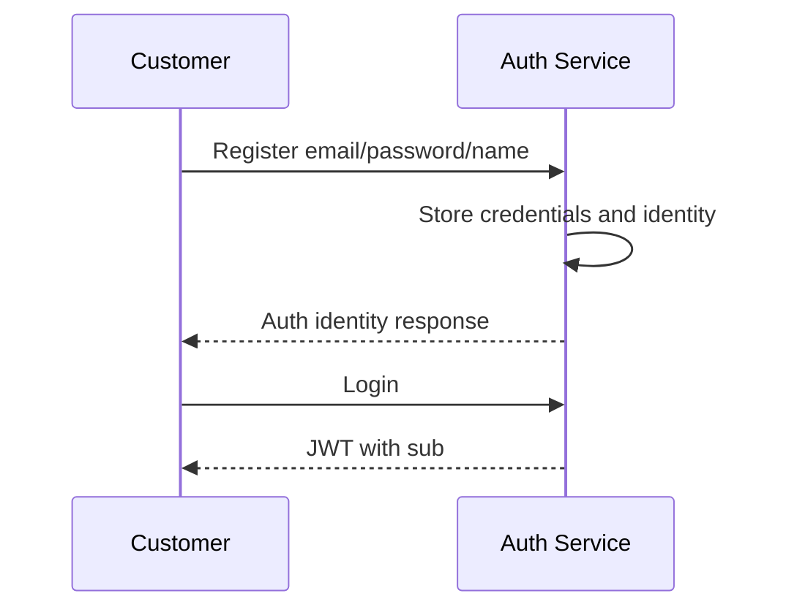

### Customer gets own profile

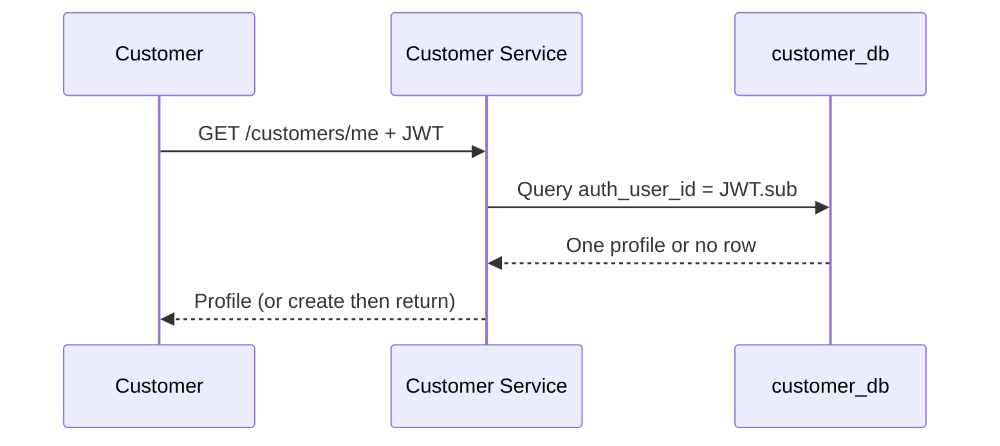

### Customer updates profile

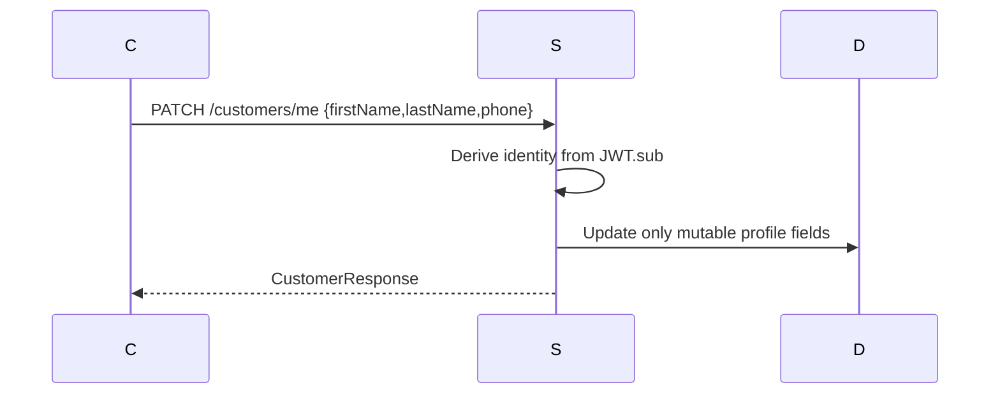

### Add address

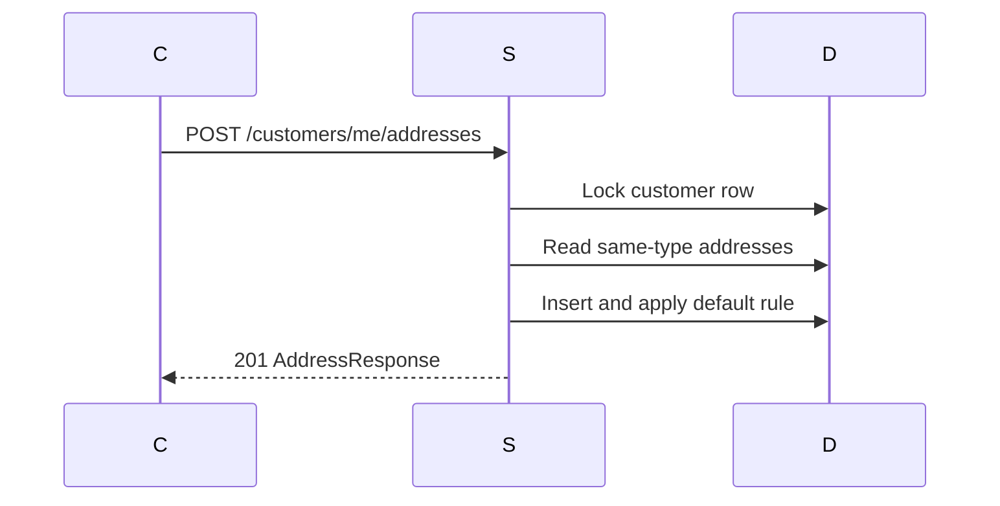

### Set default address

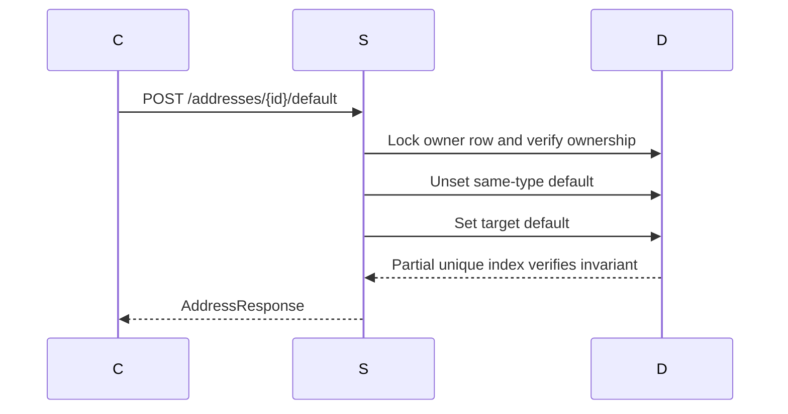

### Update address

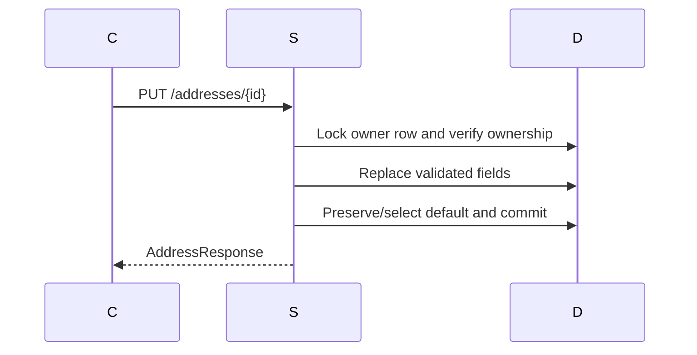

### Delete address

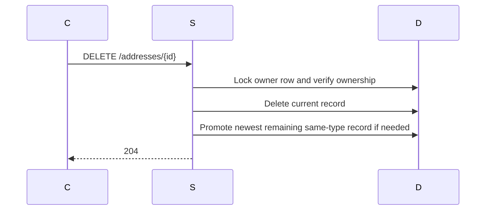

### Order obtains customer/address information

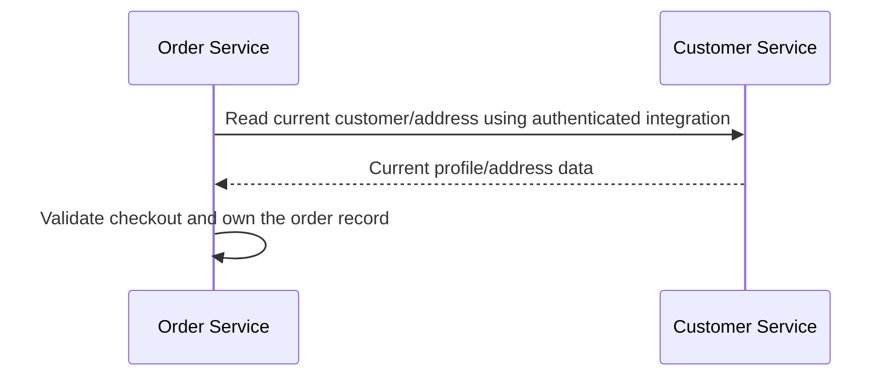

### Order address snapshot

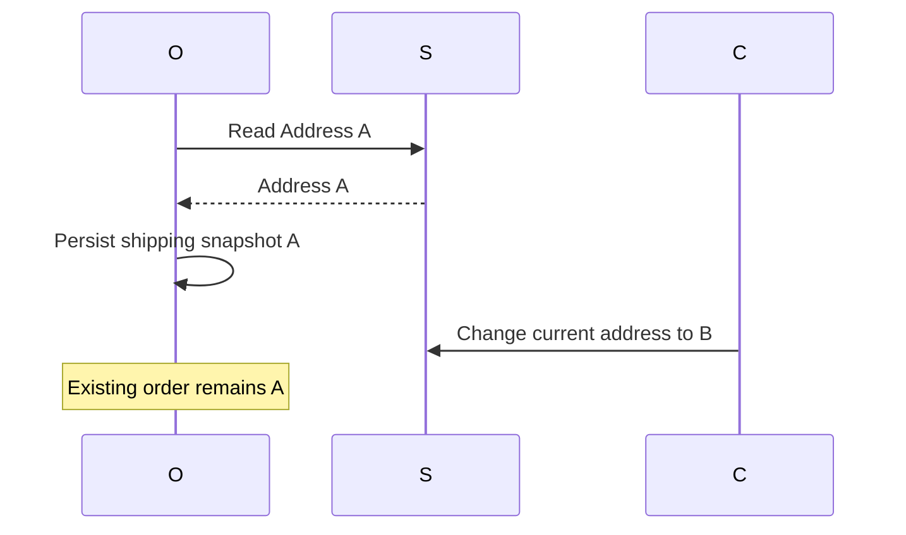

### Customer changes address after order

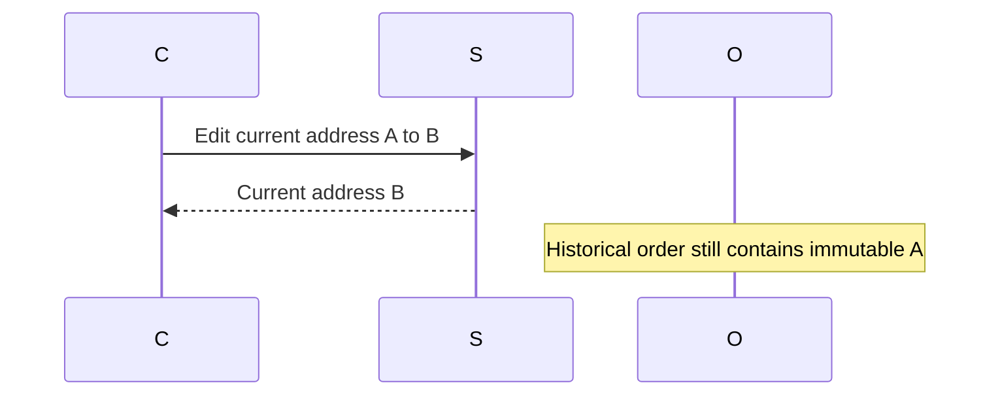

### Admin customer lookup

Admin lookup uses `CUSTOMER_READ` with server-side pagination, search, and
status filtering. Profile/status mutations use `CUSTOMER_UPDATE`. It does not
expose passwords, tokens, roles, permissions, or private Auth security data.

## API Contract Checklist

The controller, DTOs, repository/service behavior, Swagger descriptions, this
README, and the root `docs/api-contracts.md` are intentionally aligned on
paths, methods, enum values, default rules, and error behavior.
