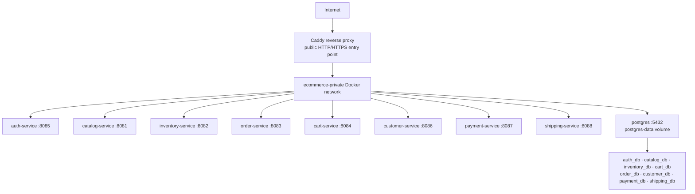

# Single-VM backend deployment

This profile runs eight separate Spring Boot containers, one PostgreSQL
container, and one Caddy reverse proxy on a single Docker host. It is suitable
for local integration, staging, demos, and low-traffic deployments where a
single point of failure is accepted. It is not a highly available production
topology.

## Topology



Service containers use Docker DNS names such as `catalog-service:8081` and
`postgres:5432`. The unified profile has no `host.docker.internal` dependency.
The independent development Compose files keep their existing host bridge
defaults so a developer can run only one service or mix host and container
processes.

## Start

```text
cp deploy/single-vm/.env.example deploy/single-vm/.env
# Generate high-entropy values for passwords and service tokens.
docker compose --env-file deploy/single-vm/.env \
  -f deploy/single-vm/compose.yml config
docker compose --env-file deploy/single-vm/.env \
  -f deploy/single-vm/compose.yml up -d --build
docker compose --env-file deploy/single-vm/.env \
  -f deploy/single-vm/compose.yml ps
```

The only host ports published by this profile are the proxy ports. Defaults are
`8080` for HTTP and `8443` for the optional HTTPS listener, which keeps local
development convenient. For a VM, set `PROXY_HTTP_PORT=80`,
`PROXY_HTTPS_PORT=443`, and `CADDY_SITE_ADDRESS` to the DNS name that points at
the VM. Caddy can then manage certificates for that hostname; certificate
issuance was not performed as part of the repository verification. An external
TLS load balancer can terminate HTTPS instead and forward HTTP to the proxy.

For production-like Auth restarts, put PEM signing keys in the ignored
`deploy/single-vm/secrets/jwt/` directory and set
`JWT_PRIVATE_KEY_PATH=/run/secrets/jwt/private.pem` and
`JWT_PUBLIC_KEY_PATH=/run/secrets/jwt/public.pem`. Blank paths intentionally
use an ephemeral development key and must not be used for a production VM.
If 8080 is already occupied, set `PROXY_HTTP_PORT` and
`PROXY_HTTPS_PORT` to free host ports; the internal routes do not change.

The browser applications are intentionally independent. For a local full-stack
run, set all `NEXT_PUBLIC_*_API_URL` variables in each frontend to
`http://localhost:8080`, start Admin on `:3000` and Storefront on `:3001`, and
use the existing Next.js `/backend/<service>` rewrites. In a hosted deployment,
point those variables at the public gateway origin (or keep the frontends'
server-side rewrites in front of the gateway).

## Stop, update, and rollback

```text
docker compose --env-file deploy/single-vm/.env \
  -f deploy/single-vm/compose.yml down
docker compose --env-file deploy/single-vm/.env \
  -f deploy/single-vm/compose.yml pull
docker compose --env-file deploy/single-vm/.env \
  -f deploy/single-vm/compose.yml up -d
```

Normal `down` does not remove `postgres-data` or `catalog-uploads`. Apply Flyway
migrations by starting the new service images; each service runs its own
migrations against its own database. Compose updates are restart-based and may
cause downtime. To roll back, pin the previous image tags in the environment,
restore the compatible database backup if a migration is not backward
compatible, and run `up -d` again. Do not use `down -v` on a persistent VM.

## Backups and restore checks

Run these commands from a protected backup location. They export logical dumps
outside the PostgreSQL container and cover every service-owned database:

```text
mkdir -p backups/$(date +%Y%m%d-%H%M%S)
BACKUP_DIR=backups/$(date +%Y%m%d-%H%M%S)
for db in auth_db catalog_db inventory_db cart_db order_db customer_db payment_db shipping_db; do
  docker compose --env-file deploy/single-vm/.env -f deploy/single-vm/compose.yml \
    exec -T postgres pg_dump --format=custom --no-owner --dbname="$db" \
    > "$BACKUP_DIR/$db.dump"
done
```

For PowerShell, create a timestamped directory and run the same `pg_dump`
command once per database with `Out-File -Encoding byte` or redirect the binary
stream to a `.dump` file. Restore into a disposable PostgreSQL instance, not the
live VM, using `pg_restore --clean --if-exists --no-owner` and the matching
database role. Verify the dump by listing tables and running the relevant
service health checks before considering it usable. A successful `pg_dump`
process alone is not a restore verification.

## Security boundary

- `postgres:5432` and ports `8081`–`8088` are Docker-internal only.
- Caddy routes known public API prefixes and the JWKS endpoint; `/internal/*`,
  actuator, OpenAPI, and Swagger paths return `404` at the proxy.
- Spring Security still authenticates and authorizes requests at each service.
- Payment and shipping webhooks remain public at their existing paths but must
  pass the service-level signature checks and idempotency checks.
- Database roles can connect only to their own database. Flyway owns schema
  creation; the init script does not create application tables.

## Limitations

This profile has one VM, one Docker host, one PostgreSQL process, and one
storage volume. A VM or database failure is a service outage; there is no
horizontal autoscaling, failover, or zero-downtime migration guarantee. Move
PostgreSQL to a managed PostgreSQL service, catalog media to object storage,
secrets to a cloud secret manager, and the proxy boundary to a managed load
balancer when higher availability is required. The eight images and their
environment-driven contracts remain reusable in OCI, AWS, Azure, GCP, or
Kubernetes.
