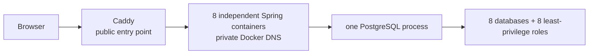
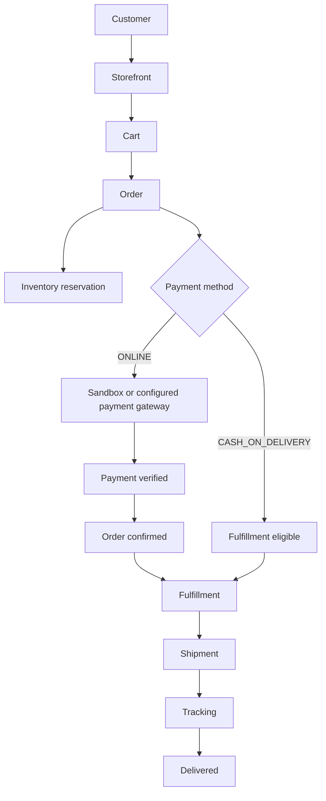

# Architecture and runtime boundaries

## Domain ownership

| Service | Owns | Database |
| --- | --- | --- |
| Auth | identity, credentials, roles, permissions, JWT/JWKS, refresh tokens | `auth_db` |
| Catalog | categories, category/product images, products, variants, SKUs, current prices | `catalog_db` |
| Inventory | locations, physical inventory units, reservations, movements, adjustments, transfers | `inventory_db` |
| Cart | current carts and cart items | `cart_db` |
| Customer | customer profile and addresses | `customer_db` |
| Order | orders, order items, historical price/address snapshots, lifecycle | `order_db` |
| Payment | payments, attempts, refunds, payment methods, gateway integration | `payment_db` |
| Shipping | fulfillments, shipments, shipment items, tracking, carrier integration | `shipping_db` |

No service imports another service's entities or opens another service's
database. Cross-service reads and state transitions use HTTP contracts and
dedicated service credentials. The repository audit found JDBC URLs only for a
service's own schema and no confirmed cross-service database access.

## Single-VM deployment

The placement is not a monolith: each service retains its own image, port,
configuration, Flyway migrations, health status, and database credentials.
Only Caddy publishes a host port in the single-VM profile. Service URLs are
environment-driven; the profile uses Docker names while host-based development
continues to use `localhost` or the existing host gateway defaults.

## Application flow

Actual state transitions and endpoint contracts are maintained in
[api-contracts.md](api-contracts.md). The payment and carrier sandbox adapters
are deterministic for CI; external gateways are optional configuration.

## Service-to-service relationships

| Caller | Callee | Contract / authentication | Failure behavior |
| --- | --- | --- | --- |
| Cart | Catalog | `GET /internal/catalog/skus/{sku}`, Cart service token | Cart returns dependency-unavailable or unknown-SKU error |
| Cart | Order | `POST /api/v1/orders`, delegated customer JWT plus idempotency key | Checkout fails without creating a second order |
| Inventory | Catalog | `GET /internal/catalog/skus/{sku}`, Inventory service token | Reservation validation fails safely |
| Order | Catalog | SKU lookup with Order service token | Order creation fails before snapshotting invalid data |
| Order | Inventory | Reservation/release APIs with Order service token | Checkout reports conflict/unavailable inventory |
| Order | Shipping | Fulfillment APIs with Order service token | Fulfillment outbox retries and surfaces dependency failure |
| Payment | Order | Internal payment validation/events with Payment service token | Payment state is not accepted without Order acknowledgement |
| Shipping | Order | Internal shipping events with Shipping service token | Shipment state remains retryable |
| Shipping | Inventory | Reservation shipping transition with Shipping service token | Shipment cannot advance without inventory transition |

User JWTs represent customer or staff identity and permissions. Service tokens
represent a specific internal relationship and are not exposed to browsers.
Some current checkout orchestration forwards the already validated customer
JWT from Cart to Order so Order can independently validate the customer subject;
the service-to-service calls themselves use the dedicated relationship tokens.

## Portability and storage

The business services use standard Spring Boot, JDBC/JPA, Flyway, HTTP, and
JWT/OIDC-compatible validation. Catalog media is behind
`ImageStorageService`/`LocalImageStorageService`; the single-VM profile persists
the local adapter with a named volume. A future object-storage adapter can be
introduced without changing catalog ownership or API contracts. No mandatory
OCI, AWS, Azure, or GCP SDK was found in runtime business code.
