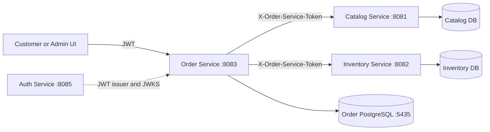
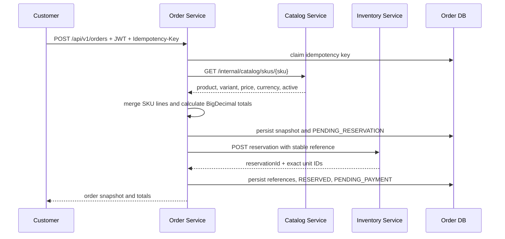
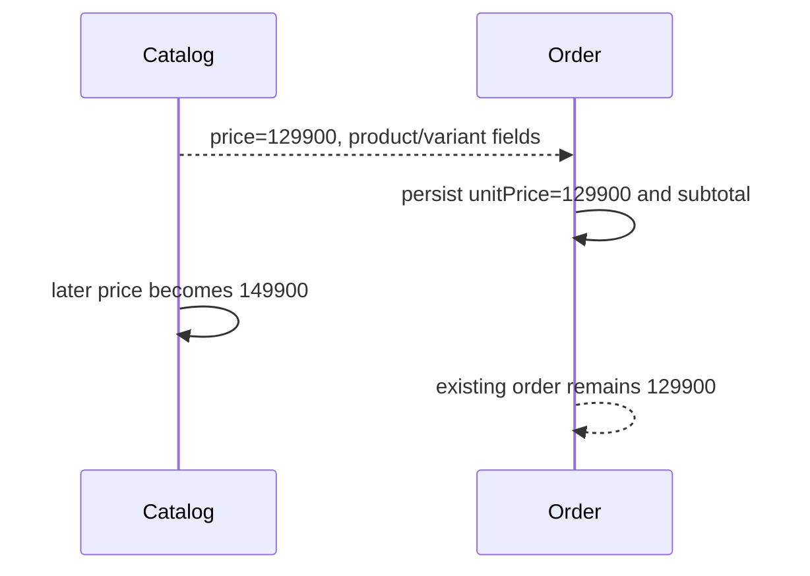
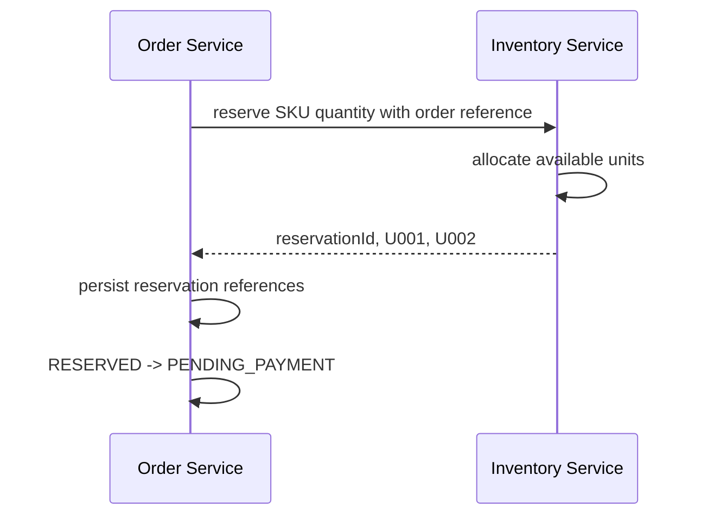
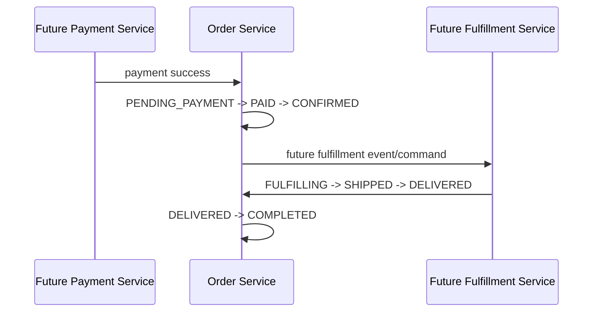
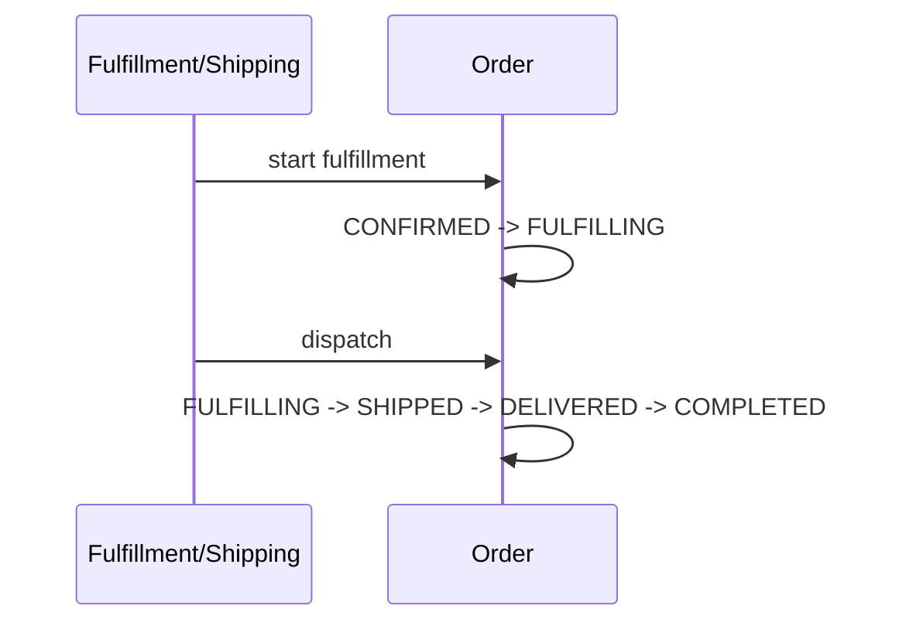

# Order Service

## Purpose

`order-service` is a standalone Spring Boot 3.5 / Java 21 microservice for the historical commercial record of a checkout. It owns order state, immutable pricing/product snapshots, idempotency, order history, and orchestration of Catalog and Inventory reservations.

It runs independently on port `8083` and uses its own PostgreSQL database on host port `5435`.

## Responsibilities

- Create and retrieve customer orders.
- Calculate money server-side with `BigDecimal`.
- Capture the current Catalog SKU, product, variant, price, currency, and attributes as an order snapshot.
- Generate unique readable order numbers.
- Enforce the order state machine and append-only order history.
- Coordinate idempotent Inventory reservations and reservation release on cancellation/compensation.
- Enforce customer ownership and permission-based staff access.
- Expose REST, OpenAPI, health, Flyway migrations, Docker, and tests.

## Non-responsibilities

- Catalog data, product CRUD, variant CRUD, or current prices.
- Inventory locations, physical units, unit status, or reservation allocation.
- Authentication, users, roles, permissions, JWT issuance, or refresh sessions.
- Payment processing, shipping, fulfillment, returns, tax rules, or customer address CRUD.

There are no foreign keys to Catalog, Inventory, or Auth databases. The service never imports their JPA entities and never reads their databases.

## Overall Architecture



`ecommerce-admin-ui` runs on port `3000`. Inside Docker, `localhost` means the current container; use Compose DNS (`order-db`) or `host.docker.internal` as shown in `docker-compose.yml`.

## Service Boundaries

| Service | Owns | Order integration |
|---|---|---|
| Catalog | products, variants, SKUs, current prices, images | `GET /internal/catalog/skus/{sku}` |
| Inventory | locations, inventory items, physical units, reservations and movements | reserve/release HTTP APIs |
| Auth | users, JWT, roles, permissions, JWKS | JWT validation only; no per-request Auth DB call |
| Order | orders, items, status, history, snapshots, idempotency, reservation references | orchestration and historical truth |

## Product / Variant / SKU Model

Catalog models `Product -> Variant -> SKU`. The SKU is the stable cross-service identifier, for example `IP17-BLK-256`. Order stores that SKU as a string and does not know or depend on Catalog entity classes.

## SKU as Cross-Service Identifier

Catalog and Inventory both accept the same normalized uppercase SKU. Catalog is authoritative for whether a SKU is active/sellable and for current product/variant/price data. Inventory is authoritative for availability, allocation, reservation state, and physical unit IDs.

## Order as Historical Commercial Record

An order is not recalculated from Catalog after creation. Each item stores `sku`, `productNameSnapshot`, `variantSnapshot`, `unitPrice`, `currency`, `quantity`, and server-calculated `subtotal`. A later Catalog price change cannot alter an existing order.

## Pricing Snapshot

The create request contains only `currency`, SKU, quantity, and optional preferred location. It does not contain authoritative prices or totals. Order Service looks up each SKU, verifies it is active, snapshots the response, and calculates:

```text
line subtotal = unit price × quantity
subtotal = sum(line subtotals)
total = subtotal - discount + shipping + tax
```

For v1, discount, shipping, and tax are all `0.00`. No tax or shipping rules are invented. The extension points are the `OrderPricing` service and the separate amount fields.

## Customer Ownership

The customer ID is always the JWT subject. `POST /api/v1/orders` does not accept `customerId`; a customer cannot create an order for another user. `GET /api/v1/orders/my` derives the subject from JWT. `GET /api/v1/orders/{id}` returns a non-disclosing 404 when a customer does not own the order.

## Authentication

Order Service is a Spring Security Resource Server. It validates JWT signature through `AUTH_JWK_SET_URI`, issuer through `AUTH_ISSUER`, audience through `AUTH_AUDIENCE`, and the token's normal expiration/time validators. It does not call Auth Service's database.

Required configuration:

```text
AUTH_ISSUER=http://localhost:8085
AUTH_AUDIENCE=ecommerce-api
AUTH_JWK_SET_URI=http://localhost:8085/.well-known/jwks.json
```

For local work without Auth Service only, set `APP_SECURITY_ENABLED=false`. Do not use that setting in a deployed environment.

## Authorization

Authorization is permission-based, not role-name based.

| Operation | Required access |
|---|---|
| Create own order | authenticated customer |
| Read own order / `my` list | authenticated customer |
| List all orders | `ORDER_READ` |
| Read another customer's order | `ORDER_READ` |
| Cancel own order in a cancellable state | authenticated owner |
| Cancel another customer's order | `ORDER_CANCEL` |

`ORDER_CREATE` and `ORDER_UPDATE` are reserved for future/admin workflows; there is no arbitrary status PATCH endpoint.

## Order Model

The `orders` table contains:

| Field | Meaning, source, validation, lifecycle |
|---|---|
| `id` | Immutable internal UUID generated by Order DB; required and never reused. |
| `orderNumber` | Required unique human-facing ID such as `ORD-20260921-000001`; generated server-side and immutable. |
| `customerId` | Required JWT subject; never accepted from public create input and immutable. |
| `status` | Required `OrderStatus`; changed only through business actions/orchestration. |
| `currency` | Required supported three-letter Catalog currency; normalized uppercase and immutable for the order. |
| `subtotal` | Required sum of item subtotals; calculated server-side and immutable for the snapshot. |
| `discountAmount` | Required calculated discount; `0.00` in v1. |
| `shippingAmount` | Required calculated shipping charge; `0.00` in v1. |
| `taxAmount` | Required calculated tax; `0.00` in v1. |
| `totalAmount` | Required server-calculated final total; never trusted from clients. |
| `createdAt` | Required UTC timestamp assigned on creation; immutable. |
| `updatedAt` | Required UTC timestamp updated by local writes. |
| `cancelledAt` | Optional UTC timestamp set only on cancellation. |
| `completedAt` | Optional UTC timestamp reserved for the future completed transition. |
| `idempotencyKey` | Optional at database level but required by the create API; scoped by `customerId`, immutable. |
| `idempotencyPayloadHash` | SHA-256 of normalized create inputs, used to reject same-key/different-payload requests. |

## Order Item Model

| Field | Meaning, source, validation, lifecycle |
|---|---|
| `id` | Immutable local UUID. |
| `orderId` | Required local relationship to `orders`; no external FK. |
| `sku` | Required uppercase Catalog/Inventory identifier; immutable. |
| `productNameSnapshot` | Required Catalog product name captured at creation; immutable historical data. |
| `variantSnapshot` | Required JSONB snapshot containing variant name and attributes; immutable historical data. |
| `unitPrice` | Required Catalog price captured at creation as `BigDecimal`; nonnegative, immutable. |
| `currency` | Required Catalog currency for the item; must match order currency. |
| `quantity` | Required positive integer/long from business input; duplicate SKUs are merged before persistence. |
| `subtotal` | Required server calculation `unitPrice × quantity`; nonnegative, immutable. |
| `createdAt` | Required UTC item creation timestamp. |
| `reservationId` | Optional remote Inventory reservation UUID; reference only, never an Order-owned entity. |
| `reservationReference` | Optional stable reference sent to Inventory; one item uses `orderNumber`, multiple items use `orderNumber:SKU`. |

`order_item_inventory_units` stores `orderItemId`, `reservationId`, `inventoryUnitId`, and the Inventory-provided `unitCode`. It is traceability, not ownership; Inventory remains the source of truth and customers do not receive these references.

## Order History and Remote Reference Fields

| Field | Meaning, source, validation, lifecycle |
|---|---|
| `orderId` | Required local owner of the history event; local FK and immutable. |
| `fromStatus` | Previous local status; nullable for the initial `ORDER_CREATED` event. |
| `toStatus` | Required resulting status; must be an explicit state-machine status. |
| `eventType` | Required server-defined business event; clients cannot supply it. |
| `referenceId` | Optional order/reservation reference used for support and recovery; never a secret. |
| `notes` | Optional server-generated operational explanation; append-only. |
| `actorUserId` | Optional JWT subject responsible for the action; never a password/token. |
| `createdAt` | Required UTC append timestamp; immutable. |
| `reservationId` | Remote Inventory UUID stored on an item; optional until reservation succeeds, never a local entity. |
| `inventoryUnitId` | Remote Inventory unit UUID in `order_item_inventory_units`; reference only and never mutated by Order. |
| `unitCode` | Inventory-provided human-readable unit code stored with the remote unit UUID for staff fulfillment views. |
| `customerId` + `idempotencyKey` | Required logical idempotency scope; customer comes from JWT and key comes from the HTTP header. |
| `orderId` in `order_idempotency` | Nullable while a claim is in progress, linked once the local order is persisted, then immutable. |

History is append-only; the order snapshot and remote reference fields are not silently refreshed from downstream services.

## Order Number

Flyway creates the PostgreSQL `order_number_sequence`. Order Service obtains a database sequence value and formats `ORD-<UTC basic date>-<six digit sequence>`, for example `ORD-20260921-000001`. The sequence is database-backed, so concurrent requests cannot collide and a value consumed by a rolled-back transaction is not reused. The UUID remains the primary key.

## Money Handling

All monetary code uses `BigDecimal` and database `numeric(19,2)`. The service never uses `double` or `float`. Client-supplied `unitPrice`, `subtotal`, discount, shipping, tax, and total fields are not accepted. Catalog prices and quantity are the only inputs to v1 calculations.

## Currency

Supported values mirror the current Catalog enum: `INR`, `USD`, `EUR`, `GBP`, `JPY`, `AUD`, `CAD`, and `SGD`. The requested currency must be supported and must match every Catalog SKU response.

## Order Status

```text
DRAFT
PENDING_RESERVATION
RESERVED
PENDING_PAYMENT
PAID
CONFIRMED
FULFILLING
SHIPPED
DELIVERED
COMPLETED
CANCELLED
FAILED
```

## Order State Machine

```mermaid
stateDiagram-v2
    [*] --> PENDING_RESERVATION: create
    PENDING_RESERVATION --> RESERVED: all reservations confirmed
    PENDING_RESERVATION --> FAILED: insufficient inventory
    PENDING_RESERVATION --> CANCELLED: cancel and release
    RESERVED --> PENDING_PAYMENT: checkout preparation complete
    RESERVED --> CANCELLED: cancel and release
    PENDING_PAYMENT --> PAID: future Payment Service
    PENDING_PAYMENT --> CANCELLED: cancel and release
    PENDING_PAYMENT --> FAILED: payment failure workflow
    PAID --> CONFIRMED
    CONFIRMED --> FULFILLING
    FULFILLING --> SHIPPED
    SHIPPED --> DELIVERED
    DELIVERED --> COMPLETED
```



The API does not expose arbitrary status mutation. Cancellation is intentionally unavailable after `SHIPPED` in v1.

## Order Creation Flow

1. Authenticate and derive the customer from JWT subject.
2. Validate request and required `Idempotency-Key`.
3. Normalize uppercase SKUs and combine duplicate lines.
4. Claim `(customerId, idempotencyKey)` locally using a unique database constraint.
5. Fetch every SKU from Catalog and reject unknown, inactive, unavailable, or malformed responses distinctly.
6. Capture the Catalog product/variant/price/currency snapshot.
7. Calculate item subtotals and order totals locally.
8. Persist the order as `PENDING_RESERVATION` and append history.
9. Request Inventory reservations. A missing preferred location means Inventory chooses the first active location with enough aggregate available stock; Order never selects units.
10. Persist each reservation ID and returned physical-unit references locally.
11. Transition to `RESERVED`, then `PENDING_PAYMENT`.
12. Return the order. No payment is processed.



### Catalog validation and price snapshot

```mermaid
sequenceDiagram
    participant O as Order Service
    participant K as Catalog Service
    O->>K: SKU lookup with service token
    alt 200 active
        K-->>O: current price and snapshot fields
        O->>O: copy fields into OrderItem
    else 404
        K-->>O: unknown SKU
        O-->>O: release idempotency claim; return 404
    else inactive
        K-->>O: active=false
        O-->>O: release idempotency claim; return 409
    else timeout or 5xx
        K-->>O: dependency failure
        O-->>O: release claim; return 503
    end
```

### Price snapshot



### Catalog failure

```mermaid
sequenceDiagram
    participant O as Order
    participant K as Catalog
    O->>K: lookup SKU
    K-->>O: timeout / 5xx / malformed response
    O->>O: no order persisted; release idempotency claim
    O-->>O: return 503 dependency error
```

### Successful checkout preparation



### Inventory failure and compensation

```mermaid
sequenceDiagram
    participant O as Order Service
    participant I as Inventory Service
    O->>I: reserve first SKU
    I-->>O: success
    O->>I: reserve next SKU
    I-->>O: insufficient or unavailable
    O->>I: release successful prior reservations
    alt all releases succeed
        O->>O: clear references; FAILED for insufficient stock
    else release cannot be confirmed
        O->>O: retain PENDING_RESERVATION and history for recovery
    end
```

### Idempotent retry

```mermaid
sequenceDiagram
    participant C as Client
    participant O as Order Service
    participant D as Order DB
    C->>O: retry same customer + Idempotency-Key
    O->>D: load claim and request hash
    alt same hash and existing order
        O-->>C: original order; resume only if PENDING_RESERVATION
    else different hash
        O-->>C: 409 Conflict
    else claim has no order yet
        O-->>C: 409 still in progress
    end
```

### Cancellation

```mermaid
sequenceDiagram
    participant C as Customer or staff
    participant O as Order Service
    participant I as Inventory Service
    C->>O: POST /api/v1/orders/{id}/cancel
    O->>O: authorize ownership or ORDER_CANCEL
    O->>I: release each active reservation
    I-->>O: released; units become AVAILABLE
    O->>O: local CANCELLED transition and history
    O-->>C: cancelled order
```

### Future payment and shipping



### Future payment

```mermaid
sequenceDiagram
    participant P as Payment Service
    participant O as Order
    P->>O: payment success
    O->>O: PENDING_PAYMENT -> PAID -> CONFIRMED
    P-->>O: payment failure (future)
    O->>O: release Inventory; CANCELLED or FAILED
```

### Future shipping



## Catalog Integration

The Catalog service exposes the smallest internal contract needed by Order:

```text
GET /internal/catalog/skus/{sku}
```

Response fields are `sku`, `productId`, `variantId`, `productName`, `variantName`, `attributes`, `price`, `currency`, and `active`. Order uses HTTP only. It does not import Catalog entities or connect to the Catalog database.

The Catalog client has separate connect/read timeouts. It maps unknown SKU to `404`, inactive SKU to `409`, timeout/connection/5xx to `503`, and malformed/mismatched data to a dependency error. It never creates an order from guessed or stale pricing.

## Inventory Integration

Order calls:

```text
POST /api/v1/inventory/{sku}/reservations
POST /api/v1/inventory/reservations/{reservationId}/release
```

The existing Inventory contract accepts an optional `locationId`. If omitted, Inventory now chooses a suitable active location; a supplied `preferredLocationId` is only a preference and does not select physical units. Inventory allocates units and returns `reservationId` plus exact unit IDs and unit codes. Order stores references only and never changes Inventory unit status.

For one-SKU orders, `referenceId` is exactly `orderNumber`. Because the current Inventory endpoint creates one reservation per SKU and enforces unique `referenceId`, multi-SKU orders use stable derived references `orderNumber:SKU`. Every reference is deterministic and reused on retries.

## Physical Inventory Units

For a quantity-two order such as `IP17-BLK-256`, Inventory may return `U001` and `U002`. Order stores those IDs and codes in `order_item_inventory_units` alongside the reservation ID for operational traceability. They remain Inventory-owned, and customer responses omit them. Admin responses with `ORDER_READ` may include both the legacy `inventoryUnitIds` list and the compact `inventoryUnits` objects containing `id` and `unitCode`.

## Reservation Model

Reservation state is owned by Inventory. The Order item stores only the remote reservation ID and stable reference. A successful reservation is persisted locally before the order is moved to `RESERVED`. Cancellation releases active reservations before the local `CANCELLED` transition. Remote release and local state updates are not one transaction; repeated release is safe against the current Inventory API.

## Idempotency

`Idempotency-Key` is required on create. `order_idempotency` enforces unique `(customer_id, idempotency_key)` and stores the normalized-request SHA-256 hash and linked order ID.

- Same customer + same key + same normalized payload: returns the original order and does not duplicate reservations.
- Same key + different payload: `409 Conflict`.
- Same key while the first request has claimed the key but has not linked an order: `409 Conflict` so a second checkout cannot race it.
- A retry of a persisted `PENDING_RESERVATION` order resumes Inventory orchestration with the same references.

## Distributed Consistency

There is no global ACID transaction. Local writes are short `@Transactional` methods. Catalog and Inventory HTTP calls happen outside those local transactions. The persisted `PENDING_RESERVATION` state, idempotency claim, deterministic reservation reference, and history support retry/reconciliation.

If Inventory succeeds but the local reference update fails, the next idempotent retry sends the same reference; Inventory returns the existing reservation and Order can persist it. If cancellation occurs during this edge case, operational reconciliation must look up the reservation by the deterministic order reference before release; this is intentionally documented as recovery work rather than being hidden behind a fake distributed transaction.

## Failure Handling

| Failure | Order behavior |
|---|---|
| Catalog unknown SKU | no order; claim released; `404` |
| Catalog inactive SKU | no order; claim released; `409` |
| Catalog unavailable/timeout/malformed | no final order; claim released; `503` |
| Inventory insufficient | release prior reservations, clear references, mark `FAILED`, return `409` |
| Inventory unavailable/timeout | retain `PENDING_RESERVATION`, append history, return `503`; same-key retry resumes |
| Partial reservation compensation fails | retain references and `PENDING_RESERVATION`, append recovery history, return dependency failure |
| local update after remote reserve fails | deterministic reference makes retry idempotent; inspect/reconcile the remote reservation |
| client retry | idempotency claim returns original order; Inventory is not duplicated |

## Cancellation

`POST /api/v1/orders/{orderId}/cancel` supports `DRAFT`, `PENDING_RESERVATION`, `RESERVED`, and `PENDING_PAYMENT`. It releases every stored active reservation, then performs the local transition and appends `ORDER_CANCELLED`. Repeated cancellation returns the already-cancelled order. Cancellation is rejected after `SHIPPED`; returns/refunds are a future workflow.

## Order History

`order_history` is append-only. The API has no order or history deletion endpoint and the history FK is intentionally not cascading, so history is not silently deleted as part of an order delete. Important events include `ORDER_CREATED`, `RESERVATION_REQUESTED`, `RESERVATION_CONFIRMED`, `RESERVATION_FAILED`, `ORDER_READY_FOR_PAYMENT`, and `ORDER_CANCELLED`. History captures the local transition, reference, note, actor subject where appropriate, and UTC timestamp.

## Address Snapshot

Shipping address snapshot persistence is deferred in v1. The service deliberately does not create mutable Customer/Address CRUD or reference another service's address table. The next enhancement is an `order_shipping_addresses` table containing `recipientName`, `phone`, `line1`, optional `line2`, `city`, `state`, `postalCode`, `country`, and `createdAt`, copied at order creation.

## API Reference

Swagger UI: [http://localhost:8083/swagger-ui.html](http://localhost:8083/swagger-ui.html)

OpenAPI JSON: [http://localhost:8083/v3/api-docs](http://localhost:8083/v3/api-docs)

The OpenAPI descriptions include bearer authentication, request validation, state enums, and the `400`, `401`, `403`, `404`, `409`, and `503` outcomes. Pagination uses scalar query parameters `page`, `size`, and `sort`; it does not generate `sort=["string"]`.

## Customer APIs

### Create order

```http
POST /api/v1/orders
Authorization: Bearer <customer-jwt>
Idempotency-Key: checkout-abc123
Content-Type: application/json

{
  "currency": "INR",
  "items": [
    {"sku": "IP17-BLK-256", "quantity": 2}
  ]
}
```

Duplicate lines for one SKU are combined before Catalog lookup and Inventory reservation.

### My orders

```http
GET /api/v1/orders/my?page=0&size=20&sort=createdAt,desc
Authorization: Bearer <customer-jwt>
```

### Get own order

```http
GET /api/v1/orders/{orderId}
Authorization: Bearer <customer-jwt>
```

### Cancel own order

```http
POST /api/v1/orders/{orderId}/cancel
Authorization: Bearer <customer-jwt>
```

## Admin APIs

The staff list endpoint requires `ORDER_READ`:

```http
GET /api/v1/orders?status=PENDING_PAYMENT&sku=IP17-BLK-256&createdFrom=2026-09-01T00:00:00Z&page=0&size=20&sort=createdAt,desc
Authorization: Bearer <staff-jwt>
```

Supported filters are `status`, partial `orderNumber`, exact `customerId`, exact normalized `sku`, `createdFrom`, and `createdTo`. Staff reads may include remote reservation and physical-unit references. A staff cancellation of another customer's order requires `ORDER_CANCEL`.

## Request/Response Examples

Successful checkout preparation returns a response shaped like:

```json
{
  "id": "7b8b7c02-7f75-4c8f-9db3-3fe1b6f7200b",
  "orderNumber": "ORD-20260921-000001",
  "customerId": "customer-123",
  "status": "PENDING_PAYMENT",
  "currency": "INR",
  "subtotal": 259800.00,
  "discountAmount": 0.00,
  "shippingAmount": 0.00,
  "taxAmount": 0.00,
  "totalAmount": 259800.00,
  "items": [{
    "sku": "IP17-BLK-256",
    "productNameSnapshot": "iPhone 17 Pro",
    "variantSnapshot": {"name": "Black / 256GB", "attributes": {"color": "Black", "storage": "256GB"}},
    "unitPrice": 129900.00,
    "quantity": 2,
    "subtotal": 259800.00
  }]
}
```

Customer responses omit reservation and physical-unit references. Staff responses with `ORDER_READ` include them where persisted. The create request remains limited to `currency`, `sku`, `quantity`, and an optional preferred location; product snapshots and prices are resolved from Catalog by Order.

## Database Schema

The Order database contains only Order-owned tables:

- `orders`
- `order_items`
- `order_history`
- `order_idempotency`
- `order_item_inventory_units`

Constraints enforce unique order numbers, unique customer/idempotency keys, positive quantities, nonnegative money, local foreign keys, and useful indexes on customer, status, creation time, SKU, history, and idempotency lookup. There are no cross-database foreign keys.

## Flyway Migrations

Migrations live in `src/main/resources/db/migration`. `V1__init_order.sql` creates the sequence, tables, constraints, indexes, and JSONB snapshot storage. Hibernate is set to `ddl-auto: validate`; schema changes must be made through new Flyway migrations.

## Docker

Build and start the standalone database/service from this directory:

```bash
mvn clean package
docker compose up --build
```

The Compose database maps host `5435` to container `5432`; the service maps `8083` to `8083`. Compose uses `order-db` for the database and defaults to `host.docker.internal` for the other services. Override service URLs and service tokens in an untracked `.env` file.

## Local Development

Prerequisites:

- Java 21
- Maven
- PostgreSQL or Docker/Colima
- Catalog on `8081`
- Inventory on `8082`
- Order on `8083`
- Auth on `8085`
- Admin UI on `3000`

Start only the Order database with `docker compose up order-db`, then run:

```bash
mvn spring-boot:run
```

The defaults are in `.env.example`. Do not commit real service tokens or secrets.

## Colima

The integration test has a repository-owned Docker socket fallback for `~/.colima/default/docker.sock` and `~/.docker/run/docker.sock`. It does not hardcode `/var/run/docker.sock` as the only path. A local Colima setup can be started with:

```bash
colima start
```

If Docker is unavailable, the Testcontainers integration test is skipped by the Testcontainers `disabledWithoutDocker` setting; it is not removed or replaced by a fake database.

## Maven

Useful commands:

```bash
mvn -q -DskipTests compile
mvn -q -DskipTests test-compile
mvn test
```

The Maven build imports the Testcontainers BOM and explicitly configures Lombok annotation processing for current JDK/Maven compiler behavior.

## Testcontainers

The integration test uses PostgreSQL 17 through the Testcontainers BOM and Flyway against a real Order database. It mocks Catalog and Inventory at the client boundary while the local persistence, migrations, pricing snapshots, reservation reference persistence, state transitions, and idempotency schema are exercised. Docker is configured through Testcontainers rather than a hardcoded socket.

## Testing

Unit coverage includes:

- `BigDecimal` line/order totals.
- Duplicate SKU merging.
- Every important state transition and invalid cancellation path.
- Catalog success, missing, inactive, malformed, and dependency responses.
- Inventory reservation parsing and insufficient-stock mapping.

Integration coverage includes:

- PostgreSQL/Flyway order persistence.
- Catalog price `129900.00` snapshot followed by a later `149900.00` Catalog price; the first order remains `129900.00`.
- Exact Inventory reservation/unit references.
- `PENDING_PAYMENT` workflow after reservation.

## Troubleshooting

### Order returns 503 from Catalog or Inventory

Check the service URL, connect/read timeout, downstream health, and the outgoing token pair. A 503 is deliberate: the Order Service does not guess prices or treat every downstream failure as an unknown SKU.

### Catalog internal endpoint returns 401/403

Set the Order's `CATALOG_SERVICE_TOKEN` to the value configured as Catalog's `ORDER_SERVICE_TOKEN`. Human JWT permissions are not forwarded.

### Inventory reservation returns 401/403

Set the Order's `INVENTORY_SERVICE_TOKEN` to the value configured as Inventory's `ORDER_SERVICE_TOKEN`. Inventory also calls Catalog using its own `CATALOG_SERVICE_TOKEN`; these are separate service credentials.

### Same idempotency key returns 409

The key belongs to a different normalized payload, or an earlier request has claimed it but has not finished linking an order. Use the original payload/key pair and inspect the order database/history for recovery.

### Existing order has old price after Catalog changed

That is expected. Order items are historical snapshots and are never recalculated from current Catalog.

## Future Payment Integration

Payment Service will move `PENDING_PAYMENT -> PAID -> CONFIRMED`. Payment failures must release Inventory through the same explicit orchestration/compensation model and transition to `FAILED` or `CANCELLED` according to the payment workflow. Order will never store card number, CVV, payment JWT, or refresh token.

## Future Shipping Integration

Fulfillment/Shipping will own shipping workflows and drive `CONFIRMED -> FULFILLING -> SHIPPED -> DELIVERED -> COMPLETED`. `completedAt` is reserved for the final local transition.

## Future Event-Driven Architecture

Kafka/full event bus is intentionally not implemented. The current local history and deterministic references leave room for a transactional outbox. Candidate future events are `OrderCreated`, `OrderReserved`, `OrderCancelled`, `OrderPaid`, `OrderConfirmed`, `OrderShipped`, and `OrderDelivered`.

## Security and Privacy Notes

Order stores only the JWT subject as `customerId`. It never stores passwords, password hashes, JWTs, refresh tokens, payment card data, CVV, or authorization headers. Logs include order identifiers, SKU, customer subject where appropriate, and reservation IDs, but not credentials or tokens.
