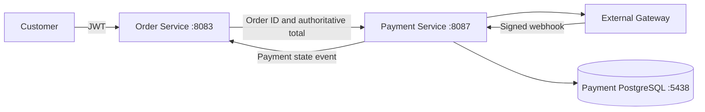

# Payment Service

`payment-service` is a standalone Spring Boot 3.5 / Java 21 service that orchestrates external payment gateways. It owns payment state, attempts, provider references, verified webhook processing, and refunds. It does not process cards, store PAN/CVV/PINs, or access the Order, Inventory, or Auth databases.

It runs on port `8087` and uses PostgreSQL on host port `5438`.

## Boundaries



Order Service remains the owner of Order state and historical totals. Payment Service reads the order through Order Service; it never trusts an amount supplied by a browser and never reads the Order database. Inventory remains behind Order orchestration.

## Gateway model

The `PaymentGateway` interface isolates provider APIs. The repository includes only `SandboxGateway`, selected by default. No production gateway credentials are invented or required. A production adapter should implement `createPayment`, `refundPayment`, `verifyWebhook`, and `parseWebhookEvent` without exposing provider-specific DTOs through this service's public API.

Sandbox checkout creation returns `PENDING`. A signed JSON webhook can move it to `AUTHORIZED`, `CAPTURED`, `FAILED`, `CANCELLED`, `PARTIALLY_REFUNDED`, or `REFUNDED`.

For the sandbox adapter, the signature is Base64 (hex is also accepted) HMAC-SHA256 over the exact request body, using `PAYMENT_SANDBOX_WEBHOOK_SECRET`.

### Adding a provider

The current repository intentionally ships only `SANDBOX`; no real provider or
credential is configured. Adding a provider requires a new adapter implementing
`PaymentGateway`, a `GatewayProvider` value, runtime configuration/secret
binding, and adapter contract tests. The application and Order Service do not
change: `PaymentApplicationService` depends only on `GatewayRegistry` and the
gateway interface. The adapter must keep provider DTOs, API authentication,
signature rules, event normalization, provider transaction references, and
refund semantics behind that interface.

Checkout responses may contain a provider checkout URL and a client-facing
checkout session token. These are not card data, PANs, CVV/PINs, API keys, or
webhook secrets: they are returned only to the owning customer and are omitted
from admin responses and logs. A production adapter must not put credentials or
payment-instrument data in `CreatePaymentResult`; if its session token is a
bearer secret, it must use the provider's short-lived/encrypted-storage model.

## Payment lifecycle

```text
CREATED -> PENDING -> AUTHORIZED -> CAPTURED
                    \-> FAILED / CANCELLED
CAPTURED -> REFUND_PENDING -> PARTIALLY_REFUNDED -> REFUNDED
                          \-> REFUNDED

CASH_ON_DELIVERY -> PENDING_COLLECTION -> CAPTURED
```

`CAPTURED` is a Payment state. It is not an Order state. The configured Order callback sends a payment-state event to `ORDER_PAYMENT_UPDATE_PATH` with the server-side payment token. When Order accepts `CAPTURED`, it moves `PENDING_PAYMENT -> PAID -> CONFIRMED` and queues automatic fulfillment creation through its transactional outbox. The callback remains best-effort at the Payment boundary; deployments should add a Payment-side outbox/retry worker if callback delivery guarantees are required.

## API

All customer payment operations require a JWT. `customerId` comes from the JWT subject and must be a UUID. `POST /api/v1/payments` accepts an `orderId`, optional provider, and the explicit `paymentMethod` enum (`ONLINE` or `CASH_ON_DELIVERY`). The amount, currency, and payment-method agreement are read from Order Service. COD creates a `PENDING_COLLECTION` record with no gateway, provider reference, checkout URL, or payment attempt; collection is confirmed by the protected admin operation after delivery.

```text
POST /api/v1/payments
Idempotency-Key: checkout-123
Authorization: Bearer <customer-jwt>
{"orderId":"<order-uuid>","preferredProvider":"SANDBOX","paymentMethod":"ONLINE"}

{"orderId":"<cod-order-uuid>","paymentMethod":"CASH_ON_DELIVERY"}

GET  /api/v1/payments/{paymentId}
GET  /api/v1/payments/order/{orderId}
POST /api/v1/payments/{paymentId}/retry
Idempotency-Key: retry-123
POST /api/v1/payments/{paymentId}/refund
Idempotency-Key: refund-123
{"amount":100.00,"reason":"Customer request"}

POST /api/v1/payments/webhooks/{provider}
X-Provider-Signature: <hmac>
<raw gateway payload>
```

The retry endpoint is available for a failed payment and appends a new `PaymentAttempt` to the same Payment. The refund amount is optional for a full refund. Refund operations are idempotent per payment and `Idempotency-Key`. The service stores all attempts and refund results instead of overwriting operational history.

Verified webhook events are claimed atomically by `(provider,
providerEventId)` before payment side effects. Re-delivery of the same signed
payload returns an idempotent acknowledgment; reusing an event ID with a
different payload is rejected. The event record stores a payload hash, not the
raw provider body.

### Internal operations API

The Admin UI uses a separate permission-protected surface so customer-owned
payment endpoints do not become an implicit cross-customer access path:

```text
GET  /api/v1/admin/payments?search=&status=&provider=&currency=&orderId=&customerId=&createdFrom=&createdTo=&page=&size=&sort=
GET  /api/v1/admin/payments/{paymentId}
POST /api/v1/admin/payments/{paymentId}/retry
     Idempotency-Key: admin-retry-123
POST /api/v1/admin/payments/{paymentId}/refunds
     Idempotency-Key: admin-refund-123
     {"amount":100.00,"reason":"Customer request"}
POST /api/v1/admin/payments/{paymentId}/collect
```

`PAYMENT_READ` protects list/detail, `PAYMENT_RETRY` protects retry, `PAYMENT_REFUND` protects refunds, and `PAYMENT_COLLECT` protects COD collection. Admin responses include payment state,
provider references, attempts, and refunds, but omit `checkoutUrl` and
`checkoutToken`. Search matches payment/order/customer UUIDs and provider
payment/order references; order numbers and customer names are owned by their
respective services and are enriched by the Admin UI only on detail screens when
the operator has the corresponding permission.

## Configuration

Copy `.env.example` for local development. `APP_SECURITY_ENABLED=false` is intended only for local work without Auth Service. The Docker Compose file creates the payment database and publishes `5438`; the application remains on `8087`.

## Docker and local execution

The multi-stage Dockerfile builds the service JAR inside the image:

```text
docker compose up -d --build
```

For host execution, start `payment-db` with `docker compose up -d payment-db`
and run `mvn spring-boot:run`. A host process uses `localhost:5438`; the
container uses the Compose database name `payment-db`. Calls to Order and Auth
use host URLs for host execution and `host.docker.internal` in the independent
Compose project. The Compose file supplies the Linux `host-gateway` mapping.

Docker Desktop, Linux Docker, and optional macOS Colima are supported by
Testcontainers through the Docker API. Integration tests are not disabled when
Docker is unavailable.

Build and test:

```bash
mvn test
mvn package
```
