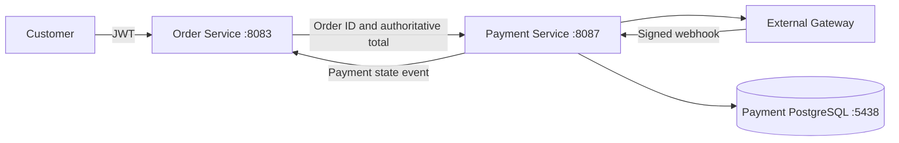

# Payment Service

`payment-service` is a standalone Spring Boot 3.5 / Java 21 service that orchestrates external payment gateways. It owns payment state, attempts, provider references, verified webhook processing, and refunds. It does not process cards, store PAN/CVV/PINs, or access the Order, Inventory, or Auth databases.

It runs on port `8087` and uses PostgreSQL on host port `5438`.

## Boundaries



Order Service remains the owner of Order state and historical totals. Payment Service reads the order through Order Service; it never trusts an amount supplied by a browser and never reads the Order database. Inventory remains behind Order orchestration.

## Gateway model

The `PaymentGateway` interface isolates provider APIs. The repository includes only `SandboxGateway`, selected by default. No production gateway credentials are invented or required. A production adapter should implement `createPayment`, `refundPayment`, `verifyWebhook`, and `parseWebhookEvent` without exposing provider-specific DTOs through this service's public API.

Sandbox checkout creation returns `PENDING`. A signed JSON webhook can move it to `AUTHORIZED`, `CAPTURED`, `FAILED`, `CANCELLED`, `PARTIALLY_REFUNDED`, or `REFUNDED`.

For the sandbox adapter, the signature is Base64 (hex is also accepted) HMAC-SHA256 over the exact request body, using `PAYMENT_SANDBOX_WEBHOOK_SECRET`.

## Payment lifecycle

```text
CREATED -> PENDING -> AUTHORIZED -> CAPTURED
                    \-> FAILED / CANCELLED
CAPTURED -> REFUND_PENDING -> PARTIALLY_REFUNDED -> REFUNDED
                          \-> REFUNDED
```

`CAPTURED` is a Payment state. It is not an Order state. The configured Order callback is best-effort and sends a payment-state event to `ORDER_PAYMENT_UPDATE_PATH`; the default is disabled because the current Order Service has not yet exposed that integration endpoint. A production deployment should back this notification with an outbox/retry worker.

## API

All customer payment operations require a JWT. `customerId` comes from the JWT subject and must be a UUID. `POST /api/v1/payments` accepts only an `orderId`, optional provider, and optional payment-method type. The amount and currency are read from the Order Service response, and the Order must be `PENDING_PAYMENT`.

```text
POST /api/v1/payments
Idempotency-Key: checkout-123
Authorization: Bearer <customer-jwt>
{"orderId":"<order-uuid>","preferredProvider":"SANDBOX","paymentMethodType":"CARD_TOKEN"}

GET  /api/v1/payments/{paymentId}
GET  /api/v1/payments/order/{orderId}
POST /api/v1/payments/{paymentId}/retry
Idempotency-Key: retry-123
POST /api/v1/payments/{paymentId}/refund
Idempotency-Key: refund-123
{"amount":100.00,"reason":"Customer request"}

POST /api/v1/payments/webhooks/{provider}
X-Provider-Signature: <hmac>
<raw gateway payload>
```

The retry endpoint is available for a failed payment and appends a new `PaymentAttempt` to the same Payment. The refund amount is optional for a full refund. Refund operations are idempotent per payment and `Idempotency-Key`. The service stores all attempts and refund results instead of overwriting operational history.

### Internal operations API

The Admin UI uses a separate permission-protected surface so customer-owned
payment endpoints do not become an implicit cross-customer access path:

```text
GET  /api/v1/admin/payments?search=&status=&provider=&currency=&orderId=&customerId=&createdFrom=&createdTo=&page=&size=&sort=
GET  /api/v1/admin/payments/{paymentId}
POST /api/v1/admin/payments/{paymentId}/retry
     Idempotency-Key: admin-retry-123
POST /api/v1/admin/payments/{paymentId}/refunds
     Idempotency-Key: admin-refund-123
     {"amount":100.00,"reason":"Customer request"}
```

`PAYMENT_READ` protects list/detail, `PAYMENT_RETRY` protects retry, and
`PAYMENT_REFUND` protects refunds. Admin responses include payment state,
provider references, attempts, and refunds, but omit `checkoutUrl` and
`checkoutToken`. Search matches payment/order/customer UUIDs and provider
payment/order references; order numbers and customer names are owned by their
respective services and are enriched by the Admin UI only on detail screens when
the operator has the corresponding permission.

## Configuration

Copy `.env.example` for local development. `APP_SECURITY_ENABLED=false` is intended only for local work without Auth Service. The Docker Compose file creates the payment database and publishes `5438`; the application remains on `8087`.

Build and test:

```bash
mvn test
mvn package
```
