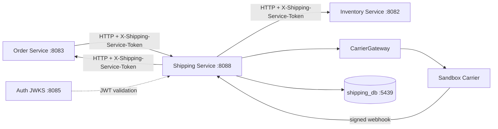
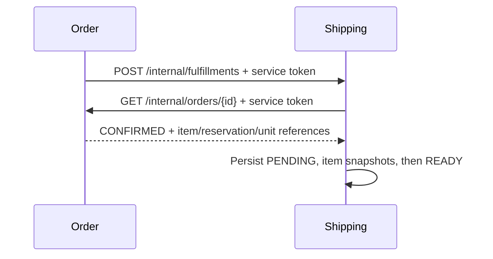
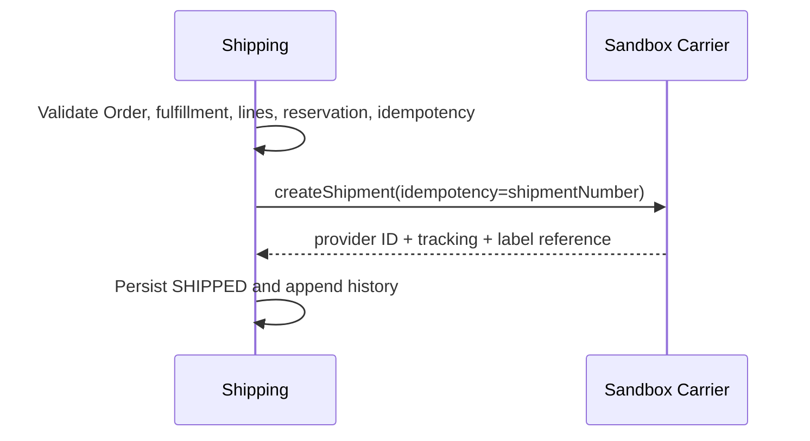
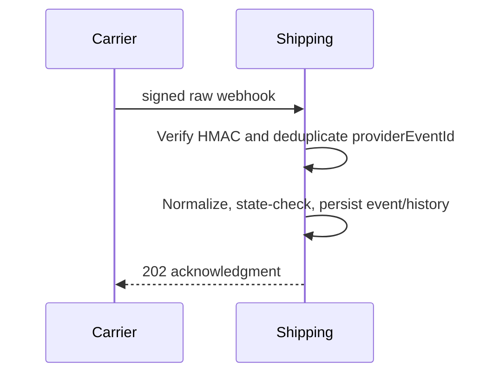

# Shipping & Fulfillment Service

## Purpose

`shipping-service` is an independently deployable Spring Boot 3.5.6 service
for operational fulfillment, shipment creation, carrier references, tracking,
delivery milestones, and recovery. It runs on port `8088` and stores only its
own data in PostgreSQL on host port `5439`.

## Responsibilities

- Create and operate fulfillments derived from eligible Orders.
- Preserve Order item snapshots and exact InventoryUnit references as
  cross-service identifiers.
- Create one or more shipments for a fulfillment.
- Keep carrier-specific behavior behind `CarrierGateway`.
- Normalize signed carrier webhooks into tracking events.
- Enforce shipment and fulfillment state machines.
- Persist append-only shipment and fulfillment history.
- Enforce JWT permissions and customer ownership.
- Make shipment creation and webhook processing retry-safe.

## Non-responsibilities

Shipping does not own Orders, payments, customers, mutable addresses, Catalog
products, reservations, physical InventoryUnits, pricing, refunds, returns,
customer notifications, warehouse management, route planning, Kafka, Redis,
Kubernetes, or live carrier credentials.

## Architecture



Every arrow is an HTTP contract. There are no cross-service database foreign
keys, entity imports, shared JPA persistence units, or distributed database
transactions.

## Service Boundaries

| Service | Source of truth |
| --- | --- |
| Auth | identity, passwords, roles, permissions, JWTs, refresh sessions |
| Customer | current profile and current address book |
| Catalog | current product, SKU, variant, and price |
| Cart | mutable shopping selection |
| Order | commercial transaction, lifecycle, price snapshots, and immutable address snapshot |
| Payment | payment attempts, gateway state, refunds, and payment webhooks |
| Inventory | physical stock, reservation, InventoryUnit identity, and unit state |
| Shipping | fulfillment, shipment, shipment items, carrier references, tracking, and shipping history |
| Carrier | physical transportation events and provider references |

## Fulfillment Model

A `Fulfillment` is the operational work for one Order. It contains the Order
identifier, business number, customer subject, an immutable copy of the Order's
shipping-address snapshot, and item snapshots. It is not a copy of the Order
and it does not create a foreign key to the Order database.

## Shipment Model

A shipment is a carrier-facing unit of transportation. Its UUID is technical;
`SHP-YYYY-MM-DD-000001` is the unique human-facing identity. An Order may have
multiple shipments. A carrier provider ID is a reference, never the business
primary identity.

## Shipment Item Model

Shipment items copy the Order item ID, SKU, and product-name snapshot. For
itemized fulfillment, there is one row per physical InventoryUnit with
`quantity=1`. For a non-itemized line, one row may carry a positive quantity and
`inventoryUnitId` is null. This avoids inventing a second quantity meaning.

## Itemized Inventory Relationship

```text
Inventory reservation RES-12345
  ├── U001
  └── U002
       ▲ exact IDs returned over HTTP
OrderItem OI-001 (IP17-BLK-256 x 2)
       ▲ order-owned reference
ShipmentItem
  ├── U001
  └── U002
```

At fulfillment and shipment creation, Shipping verifies each reservation and
unit through Inventory. It rejects U003, arbitrary IDs, wrong reservation
members, duplicate unit assignments, and unusable reservation states. It never
selects units itself and never writes `InventoryUnit.status`.

## Serialized Products

Serial number and IMEI remain Inventory-owned. Shipping stores the InventoryUnit
ID and SKU reference only. An admin can obtain serial/IMEI from Inventory using
its authorized operational API; Shipping does not duplicate mutable serial or
IMEI fields.

## Non-Serialized Products

Non-serialized inventory can still be itemized. For example, a T-shirt SKU may
reference U101 and U102 even when serial and IMEI are null. If a future
Inventory contract supplies aggregate-only quantities, Shipping can represent a
quantity row without fabricating physical IDs.

## Fulfillment Lifecycle

```text
PENDING -> READY -> ALLOCATING -> PARTIALLY_SHIPPED -> SHIPPED -> DELIVERED -> COMPLETED
    └──────────────-> FAILED -> READY/ALLOCATING
READY/ALLOCATING/PACKED -> CANCELLED
```

`PENDING` is persisted before the local item snapshot is made `READY`.
`ALLOCATING` means Shipping has validated references and is preparing a carrier
request; it does not mean Shipping owns Inventory allocation. `FAILED` is
recoverable and means a carrier or local operational step needs retry.

## Shipment Lifecycle

```text
CREATED -> READY -> PACKED -> SHIPPED -> IN_TRANSIT -> OUT_FOR_DELIVERY -> DELIVERED
    └──────-> FAILED -> READY
READY/PACKED/FAILED -> CANCELLED
DELIVERED -> RETURNED
```

The public API has no arbitrary status PATCH. Only the create workflow,
cancellation operation, and verified carrier events can advance a shipment.
`DELIVERY_FAILED` is a tracked operational state; it does not automatically
cancel or refund an Order.

## Order Integration

Before fulfillment or shipment creation, Shipping reads Order through the
protected internal HTTP contract and accepts only the actual repository states
`CONFIRMED` or `FULFILLING`. Shipping never decides whether payment succeeded;
Payment remains authoritative for payment and Order remains authoritative for
business state.

Shipping sends `FULFILLING`, `SHIPPED`, and `DELIVERED` milestones back to Order
through HTTP. A failed callback never causes a second carrier shipment: the
shipment provider ID and tracking number are persisted and an operational
notification retry endpoint remains available.

## Inventory Integration

Inventory owns reservation and physical-unit state. Shipping calls
`GET /api/v1/inventory/reservations/{reservationId}` with a dedicated
`X-Shipping-Service-Token`, confirms the exact unit set, then calls the
protected `POST /api/v1/inventory/reservations/{reservationId}/shipping-transition`
contract with `ALLOCATE`, `IN_TRANSIT`, or `RELEASE`. Inventory locks its own
reservation and units, writes `SHIPPING` movement history, and returns the
authoritative statuses. Shipping never writes InventoryUnit rows directly.

The shipment workflow allocates itemized reservations before calling the
carrier, advances them to `IN_TRANSIT` after a successful carrier response,
and releases allocations when carrier creation fails. A reservation must be
sent as its exact complete unit set; partial allocation is rejected.

## Customer/Address Integration

Customer addresses are mutable and are not read during shipment creation. At
checkout, Order persists the selected address as an immutable snapshot and
returns the full snapshot through its protected internal contract. Shipping
copies that snapshot into immutable Fulfillment columns and uses those columns
as the carrier destination. `sourceAddressId` is traceability only; Shipping
does not call Customer or hold a cross-service foreign key.

## Carrier Abstraction

`CarrierGateway` normalizes:

- `createShipment`
- `cancelShipment`
- `verifyWebhook`
- `parseWebhook`

Domain code receives `providerShipmentId`, `trackingNumber`, status, optional
estimated delivery, and label reference. No carrier SDK model is exposed to
fulfillment or tracking logic.

## Sandbox Carrier

The deterministic `SANDBOX` carrier remains the local test implementation. It
derives stable provider and tracking references from the internal shipment
idempotency key, returns a safe `sandbox://` label reference, accepts cancellation
before handoff, and signs HMAC-SHA256 webhook examples. It does not pretend to
contact a live carrier and it has no production credentials.

## EasyPost Carrier

`EASYPOST` is the production carrier adapter. It creates an EasyPost Shipment
using the Fulfillment address snapshot and configured origin/parcel defaults,
selects the requested returned rate, buys that rate, and maps the provider
shipment ID, tracking code, and label URL. Cancellation maps to the EasyPost
shipment refund endpoint. The adapter sends the shipment number as the
provider idempotency key and does not persist or log the API key.

Set `SHIPPING_PROVIDER=EASYPOST` only with runtime `EASYPOST_API_KEY`,
`EASYPOST_WEBHOOK_SECRET`, and complete `EASYPOST_ORIGIN_*` values. The
repository contains placeholders only; a real account key and webhook secret
cannot be safely inferred or fabricated here.

## Tracking

`GET /api/v1/shipments/{id}/tracking` returns shipment number, carrier, tracking
number, current status, optional carrier ETA, and normalized events. Customer
responses omit InventoryUnit IDs, provider shipment IDs, label references, and
internal failure details. Admin detail responses include appropriate operational
references.

## Tracking Events

The normalized event set is `SHIPMENT_CREATED`, `LABEL_CREATED`, `PICKED_UP`,
`IN_TRANSIT`, `OUT_FOR_DELIVERY`, `DELIVERED`, `DELIVERY_FAILED`, and `RETURNED`.
Each event stores provider event ID, carrier, event type/status, description,
location, occurrence time, receipt time, and creation time.

## Webhooks

`POST /api/v1/shipping/webhooks/{carrier}` receives the raw callback body and
the carrier-specific signature header. The processing sequence is:

1. Resolve the configured carrier adapter.
2. Verify the signature over the exact raw body.
3. Parse and normalize the provider event.
4. Atomically claim `(carrier, providerEventId)` and deduplicate.
5. Resolve the shipment by provider shipment ID or tracking number.
6. Apply the shipment state machine.
7. Append tracking and shipment history.
8. Notify Order for delivery when appropriate.
9. Return an acknowledgment.

## Webhook Signature Verification

SANDBOX uses `X-Sandbox-Signature` and `SHIPPING_WEBHOOK_SECRET`. EasyPost uses
`X-Hmac-Signature-V2`, `x-timestamp`, and `x-path`; the service validates the
timestamp freshness window and HMAC-SHA256 over the exact concatenation of
timestamp, method, path, and raw body. Secrets never appear in responses or
logs. EasyPost's documented webhook endpoint must use HTTPS in production.

## Webhook Idempotency

`carrier_webhook_events` has a unique `(carrier, provider_event_id)` constraint
and an atomic `ON CONFLICT DO NOTHING` claim before tracking side effects.
Duplicates return success without a second tracking row, state transition, or
Order notification. Reusing an event ID with a different payload is rejected.
Invalid signatures are rejected before event persistence. The full tracking
workflow is transactional, so a transient unknown-reference or processing
failure rolls back the claim and allows a legitimate carrier retry.
Malformed, unknown, wrong-reference, or out-of-order events cannot change
shipment state.

## Shipment Idempotency

`POST /api/v1/shipments` requires `Idempotency-Key`. The request hash is stored
per fulfillment and key. Repeating the same key and payload returns the existing
shipment. Reusing the key with a different payload returns `409`. A carrier
retry reuses the same shipment number as its provider idempotency key, so a
carrier that already created the shipment is not called as a new physical
shipment.

## Split Shipments

The schema supports multiple shipments under one fulfillment and explicit line
subsets. A fulfillment becomes `PARTIALLY_SHIPPED` until all planned quantities
are represented in shipped-or-later shipments. The current Order state machine
does not expose a separate partial-shipped Order state, so Shipping does not
send `SHIPPED` to Order until all fulfillment quantities are shipped.

## Packages

Version 1 supports one operational package per shipment through `packageCount=1`.
The schema intentionally leaves package expansion possible without creating
unused complexity. A future `shipment_packages` table can carry package number,
weight, dimensions, package tracking number, and package label reference.

## Labels

The carrier response stores a safe `labelReference`. The sandbox reference is
not a public downloadable file. A production adapter must provide an
authorized, time-limited retrieval path and must not expose provider credentials
or unrestricted storage URLs.

## Shipping Cost

`shippingCost` is operational carrier cost stored by Shipping and is
non-negative. Customer-facing shipping charge and Order totals remain Order or
pricing concerns. Shipping never changes Order totals.

## Cancellation

The dedicated `POST /api/v1/shipments/{id}/cancel` operation is allowed only in
`CREATED`, `READY`, `PACKED`, or `FAILED`, subject to carrier cancellation.
`SHIPPED` and later states are not cancellable in v1. Repeated cancellation is
idempotent. There is no generic status PATCH.

## Failure Handling

- Inventory or Order validation failure: no carrier call is made.
- Carrier timeout/5xx/malformed response: shipment becomes `FAILED`; it never
  becomes `SHIPPED` and remains retryable.
- Carrier success followed by Order notification failure: provider references
  and `SHIPPED` state stay persisted; only notification retry is needed.
- Duplicate webhook or shipment request: the persisted idempotency records are
  reused.
- Delivery failure: event/history are recorded without an automatic refund or
  cancellation.

## Distributed Consistency

Remote calls are deliberately outside any implied distributed transaction.
Local state is explicit, provider references are durable, and recovery uses
idempotency and compensation. `@Transactional` is used only for local Shipping
database changes. No transaction boundary claims to include Order, Inventory,
Payment, or the carrier.

## Recovery

Operators can retry a failed carrier shipment with the original creation
idempotency key and retry a failed Order notification with
`POST /api/v1/shipments/{id}/order-notification/retry`. Reconciliation should
compare persisted provider references, carrier status, Inventory reservation
membership, and Order milestones without overwriting another service's source
of truth.

## Reconciliation

The service currently exposes the data needed for a scheduled reconciliation,
but does not add a scheduler or event bus. A production job should find:

- `FAILED` shipments older than the retry threshold.
- `orderNotificationPending=true` shipments.
- shipments whose provider reference is missing or duplicated.
- webhook events ignored for out-of-order state.
- unit references no longer present in the Inventory reservation.

## Authentication

JWTs are validated locally against `AUTH_JWK_SET_URI` with issuer, audience,
signature, and expiry validation. Shipping does not query Auth for each request.
Internal Order and Inventory contracts use separate server-only shared tokens;
customer JWTs are not forwarded to those calls.

## Authorization

Implemented permission claims are:

| Permission | Used by |
| --- | --- |
| `SHIPPING_READ` | staff list/detail/fulfillment reads |
| `SHIPPING_CREATE` | shipment creation |
| `SHIPPING_CANCEL` | shipment cancellation |
| `SHIPPING_TRACK` | reserved for future tracking-only staff surface; owner tracking is authenticated |
| `SHIPPING_LABEL_CREATE` | reserved for a future dedicated label operation |
| `SHIPPING_MANAGE` | Order notification recovery |

## Roles

Auth migration `V9__add_shipping_permissions_and_roles.sql` seeds:

- `SHIPPING_ADMIN`: all implemented Shipping permissions.
- `SHIPPING_OPERATIONS`: all implemented operational permissions.
- `SHIPPING_READONLY`: `SHIPPING_READ` and `SHIPPING_TRACK`.

Role names are convenience groupings; Shipping authorizes permission claims.

## Permissions

The migration grants all `SHIPPING_*` permissions to the system-managed
`SUPER_ADMIN` role and backfills the three Shipping roles to users already
assigned `SUPER_ADMIN`, matching the existing Auth migration convention.

## Super User

After Auth Flyway migration V9, a newly issued token for a Super Admin contains
the Shipping permission union. Existing access tokens do not change; log in or
refresh after migration before verifying the claims. Shipping itself has no
special Super Admin bypass.

## Database Schema

Flyway V1 creates:

- `fulfillments`, `fulfillment_items`, and `fulfillment_history`.
- `shipments`, `shipment_items`, and `shipment_history`.
- `shipment_tracking_events`.
- `shipment_idempotency`.
- `carrier_webhook_events`.

Constraints enforce unique human shipment numbers, unique provider webhook
events, positive quantities, non-negative carrier cost, and valid local
relationships. There are intentionally no cross-service foreign keys.

## Flyway

JPA uses `ddl-auto=validate`; it never creates or changes tables. Run migration
through normal Spring startup. Do not use `ddl-auto=create`, `update`, or shared
database credentials in deployed environments.

## API Reference

Swagger UI: <http://localhost:8088/swagger-ui.html>

OpenAPI JSON: <http://localhost:8088/v3/api-docs>

Actual paths are also recorded in the repository-level
[`docs/api-contracts.md`](../docs/api-contracts.md). Pagination uses one Spring
sort value such as `sort=createdAt,desc`.

## Request/Response Examples

Create a fulfillment through the internal Order workflow:

```bash
curl -X POST http://localhost:8088/internal/fulfillments \
  -H 'Content-Type: application/json' \
  -H 'X-Order-Service-Token: <server-token>' \
  -d '{"orderId":"<order-id>"}'
```

Create a shipment as an authorized operator:

```bash
curl -X POST http://localhost:8088/api/v1/shipments \
  -H 'Authorization: Bearer <jwt>' \
  -H 'Idempotency-Key: checkout-fulfillment-1' \
  -H 'Content-Type: application/json' \
  -d '{"fulfillmentId":"<fulfillment-id>","carrier":"SANDBOX","serviceLevel":"STANDARD","currency":"INR"}'
```

## Webhook Examples

```json
{
  "providerEventId": "evt-sandbox-001",
  "providerShipmentId": "sandbox-shipment-abc",
  "trackingNumber": "SBOX1234",
  "eventType": "IN_TRANSIT",
  "location": "Udaipur hub",
  "description": "Package is moving to the destination hub",
  "occurredAt": "2026-09-22T10:00:00Z"
}
```

Generate the signature using the raw bytes and `SHIPPING_WEBHOOK_SECRET`:

```text
hex(HMAC-SHA256(secret, raw-request-body))
```

## Docker

```text
cd shipping-service
docker compose up -d --build
curl -fsS http://localhost:8088/actuator/health
```

Compose publishes `8088` and `5439`, uses `shipping-db` for container-to-
container database access, and uses `host.docker.internal` for sibling services.

### Local Admin UI demo data

The repository includes an idempotent fixture linked to the existing local Order
`ORD-20260922-000004`. It creates one `READY` fulfillment, one demo shipment,
shipment history, and one tracking event for UI testing:

```text
docker exec -i shipping-db psql -v ON_ERROR_STOP=1 -U shipping -d shipping_db < demo-seed.sql
```

Windows PowerShell equivalent:

```powershell
Get-Content demo-seed.sql | docker exec -i shipping-db psql -v ON_ERROR_STOP=1 -U shipping -d shipping_db
```

This fixture is for UI/detail testing only; it does not change Order or Inventory
state and should not be used as production data.

## Local Development

Run PostgreSQL 17 on port `5439`, copy `.env.example` to an untracked `.env`,
and start with:

```bash
mvn spring-boot:run
```

For unit-only local work, `APP_SECURITY_ENABLED=false` is acceptable only on a
developer machine. Keep it `true` for normal verification and deployment.

## Environment Variables

| Variable | Default | Meaning |
| --- | --- | --- |
| `SHIPPING_SERVER_PORT` | `8088` | HTTP port |
| `SHIPPING_DB_URL` | `jdbc:postgresql://localhost:5439/shipping_db` | Private database URL |
| `SHIPPING_DB_USERNAME` / `SHIPPING_DB_PASSWORD` | `shipping` / `shipping` | Database credentials |
| `AUTH_ISSUER` | `http://localhost:8085` | JWT issuer |
| `AUTH_AUDIENCE` | `ecommerce-api` | JWT audience |
| `AUTH_JWK_SET_URI` | Auth JWKS URL | JWT public keys |
| `ORDER_SERVICE_URL` | `http://localhost:8083` | Order HTTP base URL |
| `INVENTORY_SERVICE_URL` | `http://localhost:8082` | Inventory HTTP base URL |
| `ORDER_TO_SHIPPING_SERVICE_TOKEN` | empty | Token accepted from Order |
| `SHIPPING_TO_ORDER_SERVICE_TOKEN` | empty | Token sent to Order |
| `SHIPPING_TO_INVENTORY_SERVICE_TOKEN` | empty | Token sent to Inventory |
| `SHIPPING_PROVIDER` | `SANDBOX` | `SANDBOX` or `EASYPOST` carrier adapter |
| `SHIPPING_WEBHOOK_SECRET` | dev value | SANDBOX HMAC secret; replace outside local development |
| `EASYPOST_API_KEY` / `EASYPOST_WEBHOOK_SECRET` | empty | Runtime-only EasyPost credentials; required when `SHIPPING_PROVIDER=EASYPOST` |
| `EASYPOST_ORIGIN_*` | empty | Required ship-from address fields for EasyPost label creation |
| `SHIPPING_TIMEOUT_MS` | `5000` | Operational timeout reference |

## Maven

```bash
mvn compile
mvn test
```

The project uses Java 21, Spring Boot 3.5.6, Flyway, PostgreSQL, SpringDoc,
JUnit 5, and Testcontainers PostgreSQL 17, matching the repository's current
service versions.

## Docker runtimes and Testcontainers

Testcontainers uses the Docker API supplied by Docker Desktop, Linux Docker, or
optional macOS Colima. An explicit `DOCKER_HOST` remains authoritative. The
test-only fallback detects optional Unix sockets only on Unix-like hosts and
never constructs a Unix socket path on Windows. The integration test remains
enabled and uses a real PostgreSQL container.

## Testcontainers

`ShippingPersistenceIntegrationTest` starts PostgreSQL 17 using Testcontainers,
runs Flyway, and persists a fulfillment through JPA. Unit tests cover state
transitions, deterministic carrier output/signatures, and exact itemized unit
selection. The integration test is not skipped when Docker is unavailable; the
environment must provide a working Docker API for `mvn test`.

## Testing

Required scenarios include:

- confirmed Order to ready fulfillment; pending-payment/cancelled Orders reject.
- IP17-BLK-256 x2 traces exactly U001 and U002, never U003.
- non-serialized units still retain physical unit IDs.
- split shipments remain partial until all planned quantities ship.
- valid, invalid-signature, duplicate, malformed, unknown, wrong-reference,
  and out-of-order webhooks.
- carrier unavailable/timeout/500 never produces false `SHIPPED`.
- Order notification failure leaves provider references and retry state.
- inventory failure makes no carrier call.
- duplicate shipment key returns the original shipment.
- READY cancellation succeeds; SHIPPED cancellation is rejected.
- customer A cannot see customer B's shipment; staff requires `SHIPPING_READ`.

## Security

Do not log JWTs, refresh tokens, Authorization headers, webhook secrets,
service tokens, carrier credentials, full customer addresses, or raw sensitive
provider payloads. Logs may include fulfillment ID, shipment ID, shipment number,
Order ID/number, carrier, and tracking number when operationally safe.

## Production Considerations

Use HTTPS, a secret manager, rotated service identities, a protected webhook
endpoint, database backups, monitoring, rate limiting, structured audit logs,
carrier retry/backoff, reconciliation, and least-privilege database roles.
EasyPost is implemented as the production adapter. Set `SHIPPING_PROVIDER=EASYPOST`,
provide the API key, webhook secret, origin address, parcel defaults, and a
public HTTPS webhook URL. Do not put real credentials in `.env.example` or
source control; the repository contains only configuration placeholders.

## Future Carrier Integrations

Additional carriers can add an adapter implementing `CarrierGateway`, normalize
provider responses, implement the provider's real signature verification,
configure timeouts and idempotency semantics, and add contract tests. Do not
place provider SDK types in the domain or add credentials to source control.

## Future Returns

`RETURNED` can be recorded from a verified carrier event. A Returns Service,
refund policy, restocking, and Inventory return transition are intentionally
out of scope.

## Future Event Architecture

The service uses synchronous HTTP and durable local state in v1. Kafka, Redis,
an event bus, and a distributed workflow engine are intentionally not required.
An outbox/reconciliation worker can be added later without changing ownership.

## Field Documentation

### Fulfillment fields

| Field | Type | Required | Source, lifecycle, mutability, ownership, security |
| --- | --- | --- | --- |
| `id` | UUID | Yes | Shipping-generated immutable technical ID; never exposed as an authority. |
| `orderId` | UUID | Yes | Order response; immutable cross-service reference; no DB FK. |
| `orderNumber` | String | Yes | Order business identifier; copied for operations; immutable snapshot. |
| `customerId` | String | Yes | Auth/Order subject; copied for ownership checks; do not accept from browser. |
| `status` | Enum | Yes | Shipping state machine; only workflow/events may change it. |
| `shippingAddressReference` | String | No | Historical Order snapshot reference; immutable here; current Customer address is never substituted. |
| `createdAt` | Instant | Yes | Shipping DB timestamp; read-only. |
| `updatedAt` | Instant | Yes | Shipping lifecycle timestamp; service-managed. |
| `completedAt` | Instant | No | Set when fulfillment reaches delivered/completed; read-only. |
| `cancelledAt` | Instant | No | Set only when cancelled; read-only. |

### Shipment fields

| Field | Type | Required | Source, lifecycle, mutability, ownership, security |
| --- | --- | --- | --- |
| `id` | UUID | Yes | Shipping technical ID; immutable. |
| `shipmentNumber` | String | Yes | Shipping sequence; unique human identity; immutable and safe for support. |
| `fulfillmentId` | UUID | Yes | Local fulfillment reference; immutable. |
| `orderId` | UUID | Yes | Cross-service Order reference; immutable; no FK. |
| `orderNumber` | String | Yes | Order snapshot for operations; immutable. |
| `status` | Enum | Yes | Shipping state machine/carrier events; never browser input. |
| `carrier` | String | Yes | Selected gateway name; immutable after creation. |
| `serviceLevel` | String | Yes | Normalized operational level; immutable after carrier call. |
| `trackingNumber` | String | No | Carrier response; safe for customer tracking. |
| `providerShipmentId` | String | No | Carrier response; staff-only operational reference. |
| `labelReference` | String | No | Carrier response; staff-only and must be authorized to dereference. |
| `shippingCost` | Decimal | Yes | Carrier operational cost; non-negative; not the Order customer charge. |
| `currency` | String | Yes | Order currency snapshot; immutable. |
| `packageCount` | Integer | Yes | V1 is one package; positive. |
| `createdAt` / `updatedAt` | Instant | Yes | Shipping-managed timestamps. |
| `shippedAt` | Instant | No | Set only after carrier success. |
| `deliveredAt` | Instant | No | Set only after validated `DELIVERED`. |
| `cancelledAt` | Instant | No | Set only by cancellation workflow. |

### ShipmentItem fields

| Field | Type | Required | Source, lifecycle, mutability, ownership, security |
| --- | --- | --- | --- |
| `id` | UUID | Yes | Shipping technical row ID. |
| `shipmentId` | UUID | Yes | Local shipment relationship. |
| `orderItemId` | UUID | Yes | Order reference; immutable. |
| `sku` | String | Yes | Order snapshot; immutable. |
| `productNameSnapshot` | String | Yes | Order snapshot; immutable display value. |
| `quantity` | Long | Yes | Positive shipment quantity; for itemized rows each row is one physical unit. |
| `inventoryUnitId` | UUID | No | Exact Inventory reference; immutable; hidden from customer responses. |
| `createdAt` | Instant | Yes | Shipping-managed timestamp. |

### TrackingEvent fields

| Field | Type | Required | Source, lifecycle, mutability, ownership, security |
| --- | --- | --- | --- |
| `id` | UUID | Yes | Shipping technical event ID. |
| `shipmentId` | UUID | Yes | Local shipment relationship. |
| `trackingNumber` | String | No | Carrier snapshot; safe for tracking. |
| `carrier` | String | Yes | Normalized adapter name. |
| `eventType` | Enum | Yes | Normalized verified carrier event. |
| `eventStatus` | String | Yes | Provider/normalized status text. |
| `eventLocation` | String | No | Carrier event location; avoid sensitive address detail. |
| `description` | String | No | Provider description; bounded and sanitized. |
| `providerEventId` | String | No | Carrier idempotency key; unique with carrier. |
| `occurredAt` | Instant | Yes | Carrier event time; not fabricated. |
| `receivedAt` | Instant | Yes | Shipping receipt time. |
| `createdAt` | Instant | Yes | Local insertion time. |

## Flow Documentation

### 1. Order → Fulfillment



### 2. Inventory allocation

```mermaid
sequenceDiagram
  participant S as Shipping
  participant I as Inventory
  S->>I: GET reservation + Shipping token
  I-->>S: reservation + U001/U002 + authoritative statuses
  S->>S: Validate exact references; never update InventoryUnit
```

### 3. Shipment creation



### 4. Carrier shipment creation

Carrier creation is outside the Shipping database transaction. Shipping first
persists a retryable `READY` shipment, then calls the gateway. A crash after
carrier success can retry with the same shipment number, and the provider
idempotency contract returns the same physical shipment.

### 5. Tracking webhook



### 6. Shipment delivery

`DELIVERED` moves Shipment to `DELIVERED`, appends history, moves the
fulfillment to `DELIVERED` when all of its shipments are delivered, and
notifies Order. Order decides its own final `DELIVERED`/`COMPLETED` behavior.

### 7. Failed carrier call

```text
READY shipment -> carrier timeout/5xx -> FAILED shipment
                                      -> fulfillment FAILED/recoverable
                                      -> no SHIPPED state
                                      -> retry with same idempotency key
```

### 8. Inventory failure

If reservation lookup or exact unit validation fails, Shipping returns a
conflict/dependency error before creating a carrier shipment or advancing the
Order to `FULFILLING`. Order remains authoritative and the fulfillment can be
retried after the reservation is repaired or renewed.

### 9. Order notification failure

```text
Carrier creates shipment -> Shipping persists provider ID/tracking/SHIPPED
                         -> Order callback unavailable
                         -> orderNotificationPending=true
                         -> retry callback only; never create carrier shipment again
```

### 10. Split shipment

```text
Fulfillment (3 units)
  ├── Shipment 1 (2 units) -> SHIPPED
  └── Shipment 2 (1 unit)  -> SHIPPED
Fulfillment -> SHIPPED only after both quantities are complete
```

### 11. Shipment cancellation

```text
READY/PACKED -> carrier cancel (if provider reference exists) -> CANCELLED
SHIPPED      -> 409; transportation has already started
```

### 12. Future returns

```text
Carrier RETURNED event -> Shipping RETURNED/history -> future Returns Service
                                                     -> future Inventory return
                                                     -> future Payment refund rules
```

## Source-of-Truth Documentation

Shipping stores snapshots and references for operational traceability, not
ownership transfer. Auth owns identity/security; Customer owns current profile
and addresses; Catalog owns current SKU data; Cart owns shopping selection;
Order owns commercial state, historical price, and eventual address snapshot;
Payment owns payment state; Inventory owns physical units/reservations; Carrier
owns transportation events; Shipping owns fulfillment/shipment/tracking state.

## Order Status Interaction

Order status and Shipping status are separate state machines. A typical path is
`Order CONFIRMED → Fulfillment READY → Shipment SHIPPED`; Shipping notifies
Order, and Order applies its own `FULFILLING → SHIPPED` transition. Shipping is
not an alternative Order database or status authority.

## Inventory Status Interaction

Inventory owns `AVAILABLE`, `RESERVED`, `ALLOCATED`, `IN_TRANSIT`, `SOLD`,
`RETURNED`, `DAMAGED`, and `LOST` as implemented by Inventory. Shipping only
accepts a returned authoritative reference and does not set any unit status.

## Customer Data

Shipping does not call Customer to replace an Order address snapshot. A later
Customer address change must not change an existing destination.

## Service-to-Service Auth

Order-to-Shipping uses `X-Order-Service-Token` accepted only on internal
fulfillment routes. Shipping-to-Order uses `X-Shipping-Service-Token` on Order's
internal read/milestone routes. Shipping-to-Inventory uses
`X-Shipping-Service-Token` on Inventory's reservation read route. Values are
configured independently and are never logged or exposed to frontend code.

## Admin Role/Permission Integration

Auth migration V9 seeds the Shipping permission catalog and role mappings.
Restart Auth or run its normal Flyway migration, then issue a fresh token and
verify that a Super Admin token contains `SHIPPING_READ`, `SHIPPING_CREATE`,
`SHIPPING_CANCEL`, `SHIPPING_TRACK`, `SHIPPING_LABEL_CREATE`, and
`SHIPPING_MANAGE`. The Admin UI is intentionally unchanged in this task.

## Security Audit

The service contains no passwords, JWTs, refresh tokens, gateway credentials,
or cross-service datasource configuration. Search before deployment:

```bash
rg -n "password|secret|Authorization|Bearer|jwt|refresh|token" src/main/java src/main/resources
```

Review matches as configuration names or safe header handling; do not commit
real values.

## Health

`GET /actuator/health` is public and returns health without datasource details.
Swagger and OpenAPI are public documentation endpoints; operational API data
remains protected.

## Known Limitations

- Live EasyPost calls require an EasyPost account, valid runtime credentials,
  configured origin address/rates, and a public HTTPS webhook URL; local tests
  use SANDBOX or mocked EasyPost responses.
- Shipping allocation requires the exact complete unit set for a reservation;
  partial reservation-to-shipment allocation is intentionally rejected until a
  split-allocation contract is added.
- Package table, label download, retries worker, reconciliation scheduler,
  returns/refunds, and customer notifications are future work.
- The current Order state machine has no first-class partial-shipped state;
  Shipping keeps split shipments internally consistent and delays the final
  Order SHIPPED notification until all quantities ship.
